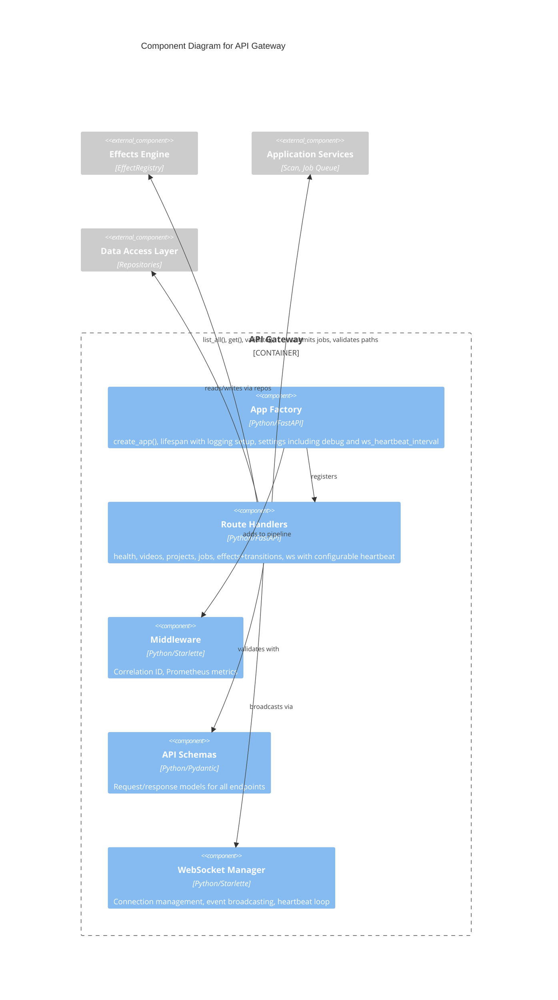

# C4 Component Level: API Gateway

## Overview
- **Name**: API Gateway
- **Description**: FastAPI application providing REST endpoints for videos, projects, clips, effects, transitions, and jobs, plus WebSocket connectivity with configurable heartbeat, middleware, request/response schemas, and configuration
- **Type**: Application
- **Technology**: Python, FastAPI, Starlette, Pydantic, Prometheus, WebSocket

## Purpose

The API Gateway is the HTTP/WebSocket entry point for all client interactions with stoat-and-ferret. It provides a RESTful API for managing videos, projects, clips, jobs, effects (with full CRUD on clip effects), and transitions between clips, plus a WebSocket endpoint for real-time event broadcasting. The gateway handles request routing, input validation via Pydantic schemas, cross-cutting concerns (correlation IDs, Prometheus metrics), and application lifecycle management.

The gateway uses FastAPI's dependency injection system for testability -- repositories, job queues, and services are injected via `create_app()` kwargs, allowing tests to substitute in-memory doubles without monkey-patching. The application factory pattern (`create_app()`) configures all routers, middleware, metrics, and static file serving.

The effects router provides full CRUD operations for effects on clips (apply, update at index, delete at index), transition application between adjacent clips, and effect discovery with parameter schemas and AI hints. The WebSocket endpoint supports configurable heartbeat intervals from application settings, wired via the `ws_heartbeat_interval` setting on startup.

## Software Features
- **REST API**: CRUD endpoints for videos, projects, clips, and jobs under `/api/v1/`
- **Effects Discovery**: List all available effects with parameter schemas and AI hints
- **Effect Preview**: Preview FFmpeg filter strings without applying
- **Effect CRUD on Clips**: Apply, update, and remove effects at specific indices on clips
- **Transition Application**: Apply transitions between adjacent clips with type selection
- **WebSocket**: Real-time event broadcasting at `/ws` with configurable heartbeat interval and connection management
- **Health Checks**: Liveness (`/health/live`) and readiness (`/health/ready`) probes
- **Request Tracing**: Correlation ID middleware for distributed tracing
- **Metrics**: Prometheus HTTP request metrics, effect application counters, and `/metrics` endpoint
- **Schema Validation**: Pydantic models for all request/response payloads
- **Static File Serving**: GUI static files mounted at `/gui`
- **Configuration**: Environment-based settings with `STOAT_` prefix including `debug`, `ws_heartbeat_interval`, and `allowed_scan_roots`

## Code Elements

This component contains:
- [c4-code-stoat-ferret-api.md](./c4-code-stoat-ferret-api.md) -- Application factory, settings (including `ws_heartbeat_interval`, `debug`), lifespan management with structured logging setup, entry point
- [c4-code-python-api.md](./c4-code-python-api.md) -- Higher-level API layer overview
- [c4-code-stoat-ferret-api-routers.md](./c4-code-stoat-ferret-api-routers.md) -- REST/WebSocket route handlers (health, videos, projects, jobs, effects with CRUD and transitions, ws with configurable heartbeat)
- [c4-code-stoat-ferret-api-middleware.md](./c4-code-stoat-ferret-api-middleware.md) -- CorrelationIdMiddleware, MetricsMiddleware
- [c4-code-stoat-ferret-api-schemas.md](./c4-code-stoat-ferret-api-schemas.md) -- Pydantic request/response models including effect and transition schemas
- [c4-code-python-schemas.md](./c4-code-python-schemas.md) -- Schema definitions overview
- [c4-code-stoat-ferret-api-websocket.md](./c4-code-stoat-ferret-api-websocket.md) -- ConnectionManager, EventType, event builder

## Interfaces

### REST API
- **Protocol**: HTTP/REST (JSON)
- **Key Operations**:
  - `GET /health/live` -- Liveness probe
  - `GET /health/ready` -- Readiness probe (DB + FFmpeg checks)
  - `GET/POST/DELETE /api/v1/videos` -- Video CRUD with search and scan
  - `GET/POST/DELETE /api/v1/projects` -- Project CRUD
  - `GET/POST/PATCH/DELETE /api/v1/projects/{id}/clips` -- Clip CRUD
  - `GET /api/v1/effects` -- List all available effects
  - `POST /api/v1/effects/preview` -- Preview filter string
  - `POST /api/v1/projects/{id}/clips/{id}/effects` -- Apply effect to clip
  - `PATCH /api/v1/projects/{id}/clips/{id}/effects/{idx}` -- Update effect at index
  - `DELETE /api/v1/projects/{id}/clips/{id}/effects/{idx}` -- Remove effect at index
  - `POST /api/v1/projects/{id}/effects/transition` -- Apply transition between clips
  - `GET /api/v1/jobs/{id}` -- Get job status

### WebSocket API
- **Protocol**: WebSocket (JSON messages)
- **Operations**: `WS /ws` -- Real-time events (HEALTH_STATUS, SCAN_STARTED, SCAN_COMPLETED, PROJECT_CREATED, HEARTBEAT) with configurable `ws_heartbeat_interval` (default 30s)

### Prometheus Metrics
- **Operations**: `GET /metrics` -- Request count, duration histograms, effect application counters by type

## Dependencies

### Components Used
- **Application Services**: Scan service, thumbnail service for business logic
- **Data Access Layer**: Repository protocols for video, project, clip persistence
- **Effects Engine**: EffectRegistry for effect discovery, validation, and filter generation
- **Python Bindings Layer**: Clip validation via `stoat_ferret_core`

### External Systems
- **uvicorn**: ASGI server
- **Prometheus**: Metrics collection
- **Starlette**: WebSocket support and middleware infrastructure

## Component Diagram

