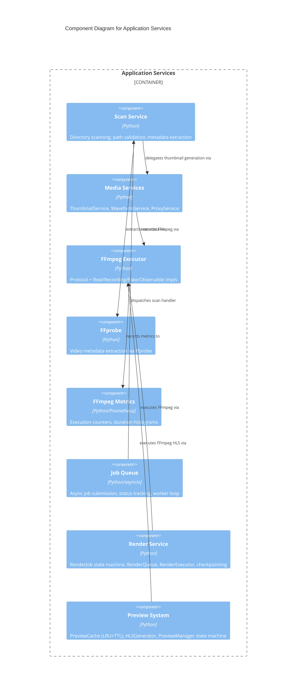

# C4 Component Level: Application Services

## Overview
- **Name**: Application Services
- **Description**: Business logic layer providing video scanning, thumbnail generation, FFmpeg execution, and asynchronous job processing
- **Type**: Service
- **Technology**: Python, asyncio, subprocess, Prometheus

## Purpose

The Application Services component encapsulates the core business operations of stoat-and-ferret, decoupled from HTTP routing. It provides three key capabilities: a video scanning service that discovers and catalogs video files using ffprobe, an FFmpeg execution layer with a testable abstraction (protocol + multiple implementations), and an async job queue for long-running background operations.

This layer bridges the API Gateway (which handles HTTP concerns) and the Data Access Layer (which handles persistence), implementing the business rules that connect them. The FFmpeg execution layer is particularly notable for its recording/replay pattern that enables deterministic testing without requiring FFmpeg to be installed.

## Software Features
- **Directory Scanning**: Recursive video file discovery with metadata extraction via ffprobe
- **Thumbnail Generation**: FFmpeg-based thumbnail creation plus sprite sheet generation
- **Waveform Generation**: PNG and JSON waveform files from audio tracks
- **Proxy Generation**: Lower-resolution proxy file generation with LRU quota eviction and SHA-256 staleness detection
- **FFmpeg Abstraction**: Protocol-based executor with Real, Recording, Fake, and Observable implementations
- **Metrics and Logging**: Observable executor decorator adding Prometheus metrics and structured logging
- **Async Job Queue**: Background task processing with timeout, status tracking, and handler registration
- **Path Security**: Scan path validation against allowed root directories
- **Rust Command Bridge**: Integration layer connecting Rust FFmpegCommand builder with Python executor
- **Render Pipeline**: RenderJob state machine, RenderQueue (persistent FIFO), RenderExecutor (FFmpeg subprocess), RenderService orchestration
- **Render Checkpointing**: RenderCheckpointManager for resumable render operations
- **Preview System**: PreviewCache (LRU+TTL), HLSGenerator (FFmpeg HLS VOD), PreviewManager session state machine (INITIALIZING→GENERATING→READY/SEEKING)
- **Migration Safety Service**: MigrationService wraps Alembic `upgrade` with pre-upgrade backup, `migration_history` audit rows, and structured `deployment.migration` events; stored on `app.state.migration_service`
- **Synthetic Monitoring**: SyntheticMonitoringTask is a conditional background asyncio task that periodically probes `/health/ready`, `/api/v1/version`, and `/api/v1/system/state`; activated only when the `STOAT_SYNTHETIC_MONITORING` feature flag is enabled
- **Benchmark Tooling**: Python wrapper benchmarks comparing Rust vs Python implementations (timeline math, filter escape, path validation)
- **Dev Scripts**: export_openapi.py, check_openapi_freshness.py, seed_sample_project.py, uat_runner.py

## Code Elements

This component contains:
- [c4-code-stoat-ferret-api-services.md](./c4-code-stoat-ferret-api-services.md) -- ProxyService, ThumbnailService, WaveformService, scan_directory(), validate_scan_path()
- [c4-code-stoat-ferret-ffmpeg.md](./c4-code-stoat-ferret-ffmpeg.md) -- FFmpegExecutor protocol, Real/Recording/Fake/Observable implementations, ffprobe, metrics, integration bridge
- [c4-code-stoat-ferret-jobs.md](./c4-code-stoat-ferret-jobs.md) -- AsyncJobQueue protocol, AsyncioJobQueue (production), InMemoryJobQueue (testing)
- [c4-code-stoat-ferret-render.md](./c4-code-stoat-ferret-render.md) -- RenderJob model, RenderCheckpointManager, RenderQueue, RenderExecutor, RenderService, AsyncSQLiteRenderRepository
- [c4-code-stoat-ferret-preview.md](./c4-code-stoat-ferret-preview.md) -- PreviewCache (LRU+TTL), HLSGenerator, PreviewManager session state machine
- [c4-code-benchmarks.md](./c4-code-benchmarks.md) -- Python benchmark suite comparing Rust vs Python performance
- [c4-code-scripts.md](./c4-code-scripts.md) -- Dev scripts: export_openapi.py, check_openapi_freshness.py, seed_sample_project.py, uat_runner.py

## Interfaces

### Scan Service
- **Protocol**: Function calls (internal)
- **Operations**:
  - `validate_scan_path(path: str, allowed_roots: list[str]) -> str | None`
  - `scan_directory(path, recursive, repository, thumbnail_service) -> ScanResponse`
  - `make_scan_handler(repository, thumbnail_service) -> Callable`

### FFmpeg Executor
- **Protocol**: Python protocol (function calls)
- **Operations**:
  - `run(args: list[str], *, stdin: bytes | None, timeout: float | None) -> ExecutionResult`
  - `execute_command(executor, command: FFmpegCommand, *, timeout) -> ExecutionResult`

### FFprobe
- **Operations**: `ffprobe_video(path: str) -> VideoMetadata`

### Thumbnail Service
- **Operations**:
  - `generate(video_path: str, video_id: str) -> str | None`
  - `get_thumbnail_path(video_id: str) -> str | None`

### Job Queue
- **Protocol**: Python protocol (async)
- **Operations**:
  - `submit(job_type: str, payload: dict) -> str`
  - `get_status(job_id: str) -> JobStatus`
  - `get_result(job_id: str) -> JobResult`

### Render Service
- **Protocol**: Function calls (internal)
- **Operations**:
  - `RenderService.submit(job: RenderJob) -> str`
  - `RenderService.cancel(job_id: str) -> None`
  - `RenderExecutor.execute(job: RenderJob) -> None`

### Preview Manager
- **Protocol**: Function calls (internal)
- **Operations**:
  - `PreviewManager.start(clip_id: str, quality: PreviewQuality) -> PreviewSession`
  - `PreviewManager.seek(session_id: str, position: float) -> None`
  - `PreviewManager.cancel_all() -> None` -- Graceful shutdown within timeout

### Media Services
- **Protocol**: Function calls (internal)
- **Operations**:
  - `ThumbnailService.generate(video_path: str, video_id: str) -> str | None`
  - `WaveformService.generate(video_path: str, video_id: str) -> tuple[str, str] | None`
  - `ProxyService.generate_proxy(video: Video) -> str | None`

### MigrationService
- **Protocol**: Function calls (internal); accessible via `app.state.migration_service`
- **Lifecycle**: Initialized at startup before the database connection opens; executes Alembic migrations with pre-upgrade SQLite backup and rollback support
- **Operations**:
  - `MigrationService.upgrade(target: str) -> MigrationResult` — Apply migrations up to `target` revision with backup; writes `migration_history` audit row on success
  - `MigrationService.downgrade(target: str) -> RollbackResult` — Revert to `target` revision; updates `migration_history` row status to `rolled_back`
- **Emitted events**: `deployment.migration` (success), `deployment.migration_rollback` (rollback)

### SyntheticMonitoringTask
- **Protocol**: asyncio background task (conditional; not a public API)
- **Activation**: Started at Phase 14 of lifespan startup when the `STOAT_SYNTHETIC_MONITORING` feature flag is `true`; inactive otherwise
- **Probed endpoints**: `GET /health/ready`, `GET /api/v1/version`, `GET /api/v1/system/state`
- **Metrics emitted**: `stoat_synthetic_check_total` (counter, labels: check_name, status) and `stoat_synthetic_check_duration_seconds` (histogram, label: check_name)

## Dependencies

### Components Used
- **Data Access Layer**: AsyncVideoRepository for persisting scanned video metadata
- **Python Bindings Layer**: FFmpegCommand (Rust) used via integration bridge

### External Systems
- **FFmpeg**: Video processing binary for thumbnails, waveforms, proxies, HLS preview, and render output
- **ffprobe**: Video metadata extraction binary
- **Prometheus**: FFmpeg execution metrics (counter, histogram, gauge)

## Component Diagram

```mermaid
C4Component
    title Component Diagram for Application Services

    Container_Boundary(services, "Application Services") {
        Component(scan, "Scan Service", "Python", "Directory scanning, path validation, metadata extraction")
        Component(media_svc, "Media Services", "Python", "ThumbnailService, WaveformService, ProxyService")
        Component(executor, "FFmpeg Executor", "Python", "Protocol + Real/Recording/Fake/Observable impls")
        Component(probe, "FFprobe", "Python", "Video metadata extraction via ffprobe")
        Component(metrics, "FFmpeg Metrics", "Python/Prometheus", "Execution counters, duration histograms")
        Component(jobs, "Job Queue", "Python/asyncio", "Async job submission, status tracking, worker loop")
        Component(render_svc, "Render Service", "Python", "RenderJob state machine, RenderQueue, RenderExecutor, checkpointing")
        Component(preview_svc, "Preview System", "Python", "PreviewCache (LRU+TTL), HLSGenerator, PreviewManager state machine")
    }

    Rel(scan, probe, "extracts metadata via")
    Rel(scan, media_svc, "delegates thumbnail generation via")
    Rel(media_svc, executor, "executes FFmpeg via")
    Rel(render_svc, executor, "executes FFmpeg via")
    Rel(preview_svc, executor, "executes FFmpeg HLS via")
    Rel(executor, metrics, "records metrics to")
    Rel(jobs, scan, "dispatches scan handler")
```
