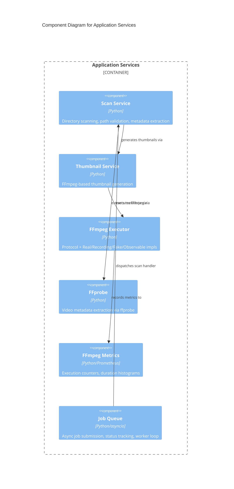

# C4 Component Level: Application Services

## Overview
- **Name**: Application Services
- **Description**: Business logic layer providing video scanning, thumbnail generation, FFmpeg execution, and asynchronous job processing
- **Type**: Service
- **Technology**: Python, asyncio, subprocess, Prometheus

## Purpose

The Application Services component encapsulates the core business operations of stoat-and-ferret, decoupled from HTTP routing. It provides three key capabilities: a video scanning service that discovers and catalogs video files using ffprobe, an FFmpeg execution layer with a testable abstraction (protocol + multiple implementations), and an async job queue for long-running background operations.

This layer bridges the API Gateway (which handles HTTP concerns) and the Data Access Layer (which handles persistence), implementing the business rules that connect them. The FFmpeg execution layer is particularly notable for its recording/replay pattern that enables deterministic testing without requiring FFmpeg to be installed.

## Software Features
- **Directory Scanning**: Recursive video file discovery with metadata extraction via ffprobe
- **Thumbnail Generation**: FFmpeg-based thumbnail creation at the 5-second mark
- **FFmpeg Abstraction**: Protocol-based executor with Real, Recording, Fake, and Observable implementations
- **Metrics & Logging**: Observable executor decorator adding Prometheus metrics and structured logging
- **Async Job Queue**: Background task processing with timeout, status tracking, and handler registration
- **Path Security**: Scan path validation against allowed root directories

## Code Elements

This component contains:
- [c4-code-stoat-ferret-api-services.md](./c4-code-stoat-ferret-api-services.md) — Scan service (directory scanning, path validation) and ThumbnailService
- [c4-code-stoat-ferret-ffmpeg.md](./c4-code-stoat-ferret-ffmpeg.md) — FFmpegExecutor protocol, Real/Recording/Fake/Observable implementations, ffprobe, metrics
- [c4-code-stoat-ferret-jobs.md](./c4-code-stoat-ferret-jobs.md) — AsyncJobQueue protocol, AsyncioJobQueue (production), InMemoryJobQueue (testing)

## Interfaces

### Scan Service
- **Protocol**: Function calls (internal)
- **Description**: Video directory scanning with metadata extraction
- **Operations**:
  - `validate_scan_path(path: str, allowed_roots: list[str]) -> str | None` — Validate scan path against allowed roots
  - `scan_directory(path, recursive, repository, thumbnail_service) -> ScanResponse` — Scan directory for videos
  - `make_scan_handler(repository, thumbnail_service) -> Callable` — Factory for job queue handler

### FFmpeg Executor
- **Protocol**: Python protocol (function calls)
- **Description**: Abstraction for FFmpeg process execution
- **Operations**:
  - `run(args: list[str], *, stdin: bytes | None, timeout: float | None) -> ExecutionResult` — Execute FFmpeg command
  - `execute_command(executor, command: FFmpegCommand, *, timeout) -> ExecutionResult` — Bridge Rust command to Python executor

### FFprobe
- **Protocol**: Function call (subprocess)
- **Description**: Video metadata extraction
- **Operations**:
  - `ffprobe_video(path: str) -> VideoMetadata` — Extract video metadata (dimensions, duration, codecs, frame rate)

### Thumbnail Service
- **Protocol**: Function calls (internal)
- **Description**: Video thumbnail generation and retrieval
- **Operations**:
  - `generate(video_path: str, video_id: str) -> str | None` — Generate JPEG thumbnail
  - `get_thumbnail_path(video_id: str) -> str | None` — Check if thumbnail exists

### Job Queue
- **Protocol**: Python protocol (async function calls)
- **Description**: Asynchronous background job processing
- **Operations**:
  - `submit(job_type: str, payload: dict) -> str` — Submit job, returns job ID
  - `get_status(job_id: str) -> JobStatus` — Get job status (PENDING/RUNNING/COMPLETE/FAILED/TIMEOUT)
  - `get_result(job_id: str) -> JobResult` — Get job result with status, value, and error

## Dependencies

### Components Used
- **Data Access Layer**: AsyncVideoRepository for persisting scanned video metadata
- **Python Bindings Layer**: FFmpegCommand (Rust) used via integration bridge

### External Systems
- **FFmpeg**: Video processing binary invoked via subprocess
- **ffprobe**: Video metadata extraction binary
- **Prometheus**: FFmpeg execution metrics (counter, histogram, gauge)

## Component Diagram

