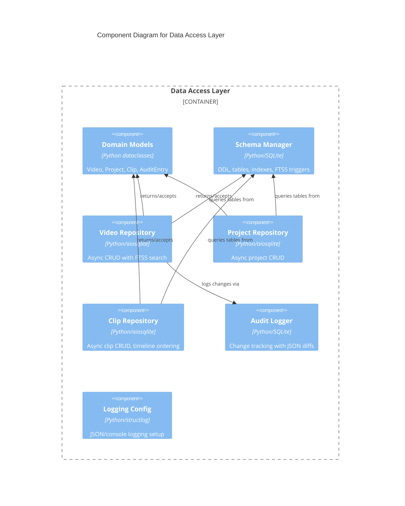

# C4 Component Level: Data Access Layer

## Overview
- **Name**: Data Access Layer
- **Description**: SQLite-based persistence layer with repository pattern for videos, projects, clips, and audit logging, plus application-wide infrastructure
- **Type**: Data Access
- **Technology**: Python, SQLite, aiosqlite, structlog

## Purpose

The Data Access Layer provides all data persistence and retrieval for stoat-and-ferret using the repository pattern. It defines protocol interfaces for video, project, and clip repositories, with both synchronous (SQLite) and asynchronous (aiosqlite) implementations, plus in-memory implementations for testing. The layer also includes domain model definitions, database schema management, FTS5 full-text search, and audit logging.

The package root (`stoat_ferret`) providing version metadata and structured logging configuration is included here as foundational infrastructure that the entire application depends on.

## Software Features
- **Repository Pattern**: Protocol-based abstractions with SQLite and in-memory implementations
- **Async Support**: Full async/await repository implementations via aiosqlite for FastAPI integration
- **Domain Models**: Dataclass definitions for Video, Project, Clip, and AuditEntry with Rust validation bridge
- **Full-Text Search**: FTS5 index on video filename/path for fast search
- **Audit Logging**: Change tracking with operation, entity type, entity ID, and JSON diff
- **Schema Management**: DDL for all tables, indexes, and FTS triggers
- **Structured Logging**: Application-wide structlog configuration with JSON/console output
- **Test Doubles**: In-memory repositories with deepcopy isolation and seed helpers

## Code Elements

This component contains:
- [c4-code-stoat-ferret-db.md](./c4-code-stoat-ferret-db.md) — Repository protocols/impls, domain models, schema, audit logger
- [c4-code-stoat-ferret.md](./c4-code-stoat-ferret.md) — Package root with version metadata and logging configuration

## Interfaces

### Video Repository (Async)
- **Protocol**: Python protocol (async function calls)
- **Description**: CRUD operations for video metadata
- **Operations**:
  - `add(video: Video) -> Video` — Store video metadata
  - `get(id: str) -> Video | None` — Retrieve by ID
  - `get_by_path(path: str) -> Video | None` — Retrieve by file path
  - `list_videos(limit: int, offset: int) -> list[Video]` — Paginated listing
  - `search(query: str, limit: int) -> list[Video]` — FTS5 full-text search
  - `count() -> int` — Total video count
  - `update(video: Video) -> Video` — Update video metadata
  - `delete(id: str) -> bool` — Delete video

### Project Repository (Async)
- **Protocol**: Python protocol (async function calls)
- **Description**: CRUD operations for editing projects
- **Operations**:
  - `add(project: Project) -> Project` — Create project
  - `get(id: str) -> Project | None` — Retrieve by ID
  - `list_projects(limit: int, offset: int) -> list[Project]` — Paginated listing
  - `update(project: Project) -> Project` — Update project
  - `delete(id: str) -> bool` — Delete project

### Clip Repository (Async)
- **Protocol**: Python protocol (async function calls)
- **Description**: CRUD operations for video clips within projects
- **Operations**:
  - `add(clip: Clip) -> Clip` — Add clip to project
  - `get(id: str) -> Clip | None` — Retrieve by ID
  - `list_by_project(project_id: str) -> list[Clip]` — List clips ordered by timeline position
  - `update(clip: Clip) -> Clip` — Update clip
  - `delete(id: str) -> bool` — Delete clip

### Logging Configuration
- **Protocol**: Function call
- **Description**: Application-wide structured logging setup
- **Operations**:
  - `configure_logging(json_format: bool, level: int) -> None` — Configure structlog with JSON or console output

## Dependencies

### Components Used
- **Python Bindings Layer**: Clip model uses `stoat_ferret_core` for Rust-side clip validation

### External Systems
- **SQLite**: Persistent storage via sqlite3 (sync) and aiosqlite (async)
- **structlog**: Structured logging framework

## Component Diagram

