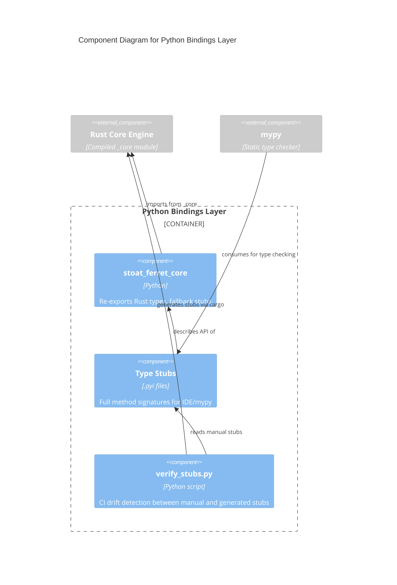

# C4 Component Level: Python Bindings Layer

## Overview
- **Name**: Python Bindings Layer
- **Description**: Python re-export package, type stubs, and stub verification tooling bridging the Rust core to the Python application
- **Type**: Library
- **Technology**: Python, PyO3 (consumer), mypy type stubs

## Purpose

The Python Bindings Layer provides the interface between the Rust Core Engine and the Python application. It consists of three parts: the `stoat_ferret_core` Python package that re-exports all types and functions from the compiled Rust extension, manually maintained `.pyi` type stubs that enable IDE autocompletion and mypy type checking, and a verification script that ensures stubs stay in sync with the Rust API.

This layer also implements graceful degradation — when the Rust extension is not built, all exports are replaced with stub functions that raise `RuntimeError` with a message to run `maturin develop`. This ensures clear error messages during development.

## Software Features
- **Type Re-export**: Clean Python API surface re-exporting all Rust types and functions
- **Fallback Stubs**: Graceful degradation with informative errors when native extension unavailable
- **Type Annotations**: Complete `.pyi` stubs with full method signatures for IDE and mypy support
- **Drift Detection**: CI-enforced verification that manual stubs cover all Rust-defined types

## Code Elements

This component contains:
- [c4-code-stoat-ferret-core.md](./c4-code-stoat-ferret-core.md) — Python re-export package with fallback stubs
- [c4-code-stubs-stoat-ferret-core.md](./c4-code-stubs-stoat-ferret-core.md) — Manually maintained .pyi type stubs
- [c4-code-scripts.md](./c4-code-scripts.md) — verify_stubs.py CI script for stub drift detection

## Interfaces

### Python Package API (`stoat_ferret_core`)
- **Protocol**: Python module import
- **Description**: All Rust Core Engine types and functions available as Python imports
- **Operations**:
  - All operations from Rust Core Engine (see that component's interfaces)
  - `health_check() -> str` — Verify native extension is loaded
  - Fallback: All functions raise `RuntimeError("native extension not built")` when Rust not compiled

### Stub Verification CLI
- **Protocol**: Command-line script
- **Description**: Verifies manual stubs include all types from generated stubs
- **Operations**:
  - `python scripts/verify_stubs.py` — Compare manual vs generated stubs, exit 1 on drift

## Dependencies

### Components Used
- **Rust Core Engine**: The compiled `_core` PyO3 extension module that provides all actual implementations

### External Systems
- **mypy**: Consumes type stubs for static type checking
- **maturin**: Builds PyO3 extension (development tool)
- **cargo**: Invoked by verify_stubs.py to run stub_gen binary

## Component Diagram

