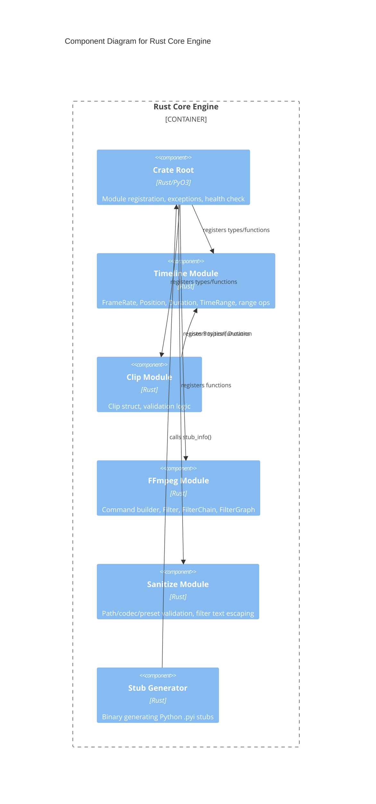

# C4 Component Level: Rust Core Engine

## Overview
- **Name**: Rust Core Engine
- **Description**: High-performance Rust library providing frame-accurate timeline math, clip validation, FFmpeg command building, and input sanitization with PyO3 bindings
- **Type**: Library
- **Technology**: Rust, PyO3, pyo3-stub-gen

## Purpose

The Rust Core Engine is the computational heart of stoat-and-ferret. It implements all performance-critical and safety-critical operations in Rust, exposing them to Python through PyO3 bindings. This includes frame-accurate timeline mathematics using integer frame counts (avoiding floating-point precision issues), video clip representation and validation, type-safe FFmpeg command construction, and input sanitization to prevent command injection.

By implementing these operations in Rust, the system achieves both correctness (Rust's type system prevents many classes of bugs) and performance (native-speed computation for timeline math and filter graph assembly). The PyO3 bindings provide a clean Python API, making the Rust library transparent to Python consumers.

## Software Features
- **Timeline Mathematics**: Frame-accurate position, duration, and time range types with set operations (overlap, gap, merge, intersection, union, difference)
- **Clip Validation**: Comprehensive validation of video clips against source constraints with detailed error reporting
- **FFmpeg Command Building**: Type-safe builder pattern for FFmpeg argument construction with filter graph support
- **Input Sanitization**: Security-focused validation of paths, codecs, presets, and FFmpeg filter text escaping
- **Stub Generation**: Binary for generating Python type stubs from PyO3 annotations

## Code Elements

This component contains:
- [c4-code-rust-stoat-ferret-core-src.md](./c4-code-rust-stoat-ferret-core-src.md) — Crate root (lib.rs), PyO3 module registration, custom exceptions, health check
- [c4-code-rust-stoat-ferret-core-timeline.md](./c4-code-rust-stoat-ferret-core-timeline.md) — FrameRate, Position, Duration, TimeRange types with range operations
- [c4-code-rust-stoat-ferret-core-clip.md](./c4-code-rust-stoat-ferret-core-clip.md) — Clip struct, ValidationError, validate_clip/validate_clips functions
- [c4-code-rust-stoat-ferret-core-ffmpeg.md](./c4-code-rust-stoat-ferret-core-ffmpeg.md) — FFmpegCommand builder, Filter, FilterChain, FilterGraph types
- [c4-code-rust-stoat-ferret-core-sanitize.md](./c4-code-rust-stoat-ferret-core-sanitize.md) — escape_filter_text, validate_path, validate_crf/speed/volume/codec/preset
- [c4-code-rust-stoat-ferret-core-bin.md](./c4-code-rust-stoat-ferret-core-bin.md) — stub_gen binary for Python type stub generation

## Interfaces

### PyO3 Module API (`_core`)
- **Protocol**: Python C extension (PyO3)
- **Description**: Exposes all Rust types and functions as a Python module
- **Operations**:
  - `health_check() -> str` — Verify extension is loaded
  - `validate_clip(clip: Clip) -> list[ClipValidationError]` — Validate single clip
  - `validate_clips(clips: list[Clip]) -> list[tuple[int, ClipValidationError]]` — Batch validate
  - `find_gaps(ranges: list[TimeRange]) -> list[TimeRange]` — Find gaps between ranges
  - `merge_ranges(ranges: list[TimeRange]) -> list[TimeRange]` — Merge overlapping ranges
  - `total_coverage(ranges: list[TimeRange]) -> Duration` — Calculate total coverage
  - `scale_filter(width: int, height: int) -> Filter` — Create scale filter
  - `concat_filter(n: int, v: int, a: int) -> Filter` — Create concat filter
  - `escape_filter_text(text: str) -> str` — Escape FFmpeg filter special chars
  - `validate_path(path: str) -> None` — Validate file path safety
  - `validate_crf(value: int) -> int` — Validate CRF range (0-51)
  - `validate_speed(value: float) -> float` — Validate speed range (0.25-4.0)
  - `validate_volume(value: float) -> float` — Validate volume range (0.0-10.0)
  - `validate_video_codec(codec: str) -> str` — Whitelist video codec
  - `validate_audio_codec(codec: str) -> str` — Whitelist audio codec
  - `validate_preset(preset: str) -> str` — Whitelist encoding preset

### Stub Generation CLI
- **Protocol**: Command-line binary
- **Description**: Generates baseline Python `.pyi` stubs from PyO3 annotations
- **Operations**:
  - `cargo run --bin stub_gen` — Generate stubs to `.generated-stubs/`

## Dependencies

### Components Used
- None (leaf component — no dependencies on other application components)

### External Systems
- **PyO3**: Rust-Python bridge for module definition and type marshaling
- **pyo3-stub-gen**: Automatic stub generation from PyO3 annotations
- **proptest** (test-only): Property-based testing for timeline invariants

## Component Diagram

