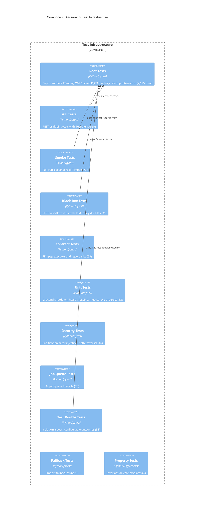

# C4 Component Level: Test Infrastructure

## Overview
- **Name**: Test Infrastructure
- **Description**: Comprehensive Python test suite covering unit, integration, contract, black-box, security, property-based, and PyO3 binding parity testing
- **Type**: Library
- **Technology**: Python, pytest, pytest-asyncio, Hypothesis, FastAPI TestClient

## Purpose

The Test Infrastructure provides thorough validation of all Python backend components. It is organized into specialized test suites: root-level unit tests for repositories, models, FFmpeg, WebSocket, and Rust binding parity (including audio/transition builders); API endpoint tests using TestClient with in-memory doubles; black-box E2E tests exercising complete workflows through HTTP; contract tests ensuring test doubles faithfully match production implementations; security tests for input sanitization and path traversal; job queue lifecycle tests; test double validation; and property-based tests using Hypothesis.

In v008, the root test suite expanded to cover structured logging startup configuration (`test_logging_startup.py`), database initialization during application lifespan (`test_database_startup.py`), and verification that previously orphaned settings (`debug`, `ws_heartbeat_interval`) are now wired to their consumers (`test_orphaned_settings.py`). Audio builder parity (`test_audio_builders.py`) and transition builder parity (`test_transition_builders.py`) were added alongside the existing PyO3 binding tests.

The test infrastructure establishes key patterns used across all suites: contract testing parametrized over implementations, the recording/replay pattern for FFmpeg testing, fluent test data builders (factories), and dependency injection via `create_app()` kwargs.

## Software Features
- **Repository Contract Tests**: Parametrized tests ensuring SQLite and InMemory implementations behave identically
- **API Endpoint Tests**: 569 tests covering all REST endpoints including effects CRUD, transitions, render, and preview
- **Black-Box E2E Tests**: 31 REST API workflow tests with InMemory doubles
- **Smoke Tests**: 77 full-stack smoke tests against real FFmpeg (scan, thumbnail, waveform, proxy, preview, render pipelines)
- **FFmpeg Contract Tests**: Record/replay parity tests for Real/Recording/Fake executors
- **Security Tests**: 46 tests for shell injection, null bytes, FFmpeg filter injection, path traversal, whitelist bypass
- **Job Queue Tests**: 25 tests for async job lifecycle, timeout, cancellation, progress, worker lifecycle
- **Test Double Validation**: 33 tests for deepcopy isolation, seed helpers, configurable outcomes, handler registration
- **Unit Tests**: 83 unit tests for graceful shutdown, health checks, preview logging, Prometheus metrics, WebSocket progress callbacks
- **PyO3 Binding Parity**: ~245 tests verifying all Rust types
- **Property-Based Tests**: 4 Hypothesis-driven invariant tests for Video and Clip models
- **Import Fallback Tests**: 3 tests for graceful degradation when Rust extension unavailable
- **Test Factories**: Fluent builders for Video, Project, and Clip test data
- **Startup Integration Tests**: Validate structured logging and database initialization during lifespan

## Code Elements

This component contains:
- [c4-code-tests.md](./c4-code-tests.md) -- Root tests: conftest, factories, repo contracts, models, FFmpeg, WebSocket, logging, PyO3 bindings, startup integration (~2,125 total tests across all suites)
- [c4-code-tests-test-api.md](./c4-code-tests-test-api.md) -- FastAPI endpoint tests with TestClient (569 tests)
- [c4-code-tests-smoke.md](./c4-code-tests-smoke.md) -- Full-stack smoke tests against real FFmpeg: scan, thumbnail, waveform, proxy, preview, render (77 tests)
- [c4-code-tests-test-blackbox.md](./c4-code-tests-test-blackbox.md) -- REST API workflow tests with InMemory doubles (31 tests)
- [c4-code-tests-test-contract.md](./c4-code-tests-test-contract.md) -- FFmpeg executor and repository parity tests (69 tests)
- [c4-code-tests-test-coverage.md](./c4-code-tests-test-coverage.md) -- Import fallback tests for Rust extension (3 tests)
- [c4-code-tests-test-jobs.md](./c4-code-tests-test-jobs.md) -- AsyncioJobQueue and worker lifecycle tests (25 tests)
- [c4-code-tests-test-doubles.md](./c4-code-tests-test-doubles.md) -- In-memory repository isolation, seed helpers, and configurable outcomes tests (33 tests)
- [c4-code-tests-unit.md](./c4-code-tests-unit.md) -- Unit tests: graceful shutdown, health checks, preview logging, Prometheus metrics, WebSocket progress callbacks (83 tests)
- [c4-code-tests-test-security.md](./c4-code-tests-test-security.md) -- Input sanitization and path validation tests (46 tests)
- [c4-code-tests-examples.md](./c4-code-tests-examples.md) -- Hypothesis property-based test templates (4 tests)

## Interfaces

### Test Execution
- **Protocol**: pytest CLI
- **Operations**:
  - `uv run pytest` -- Run all tests
  - `uv run pytest -m blackbox` -- Black-box tests only
  - `uv run pytest -m contract` -- Contract tests only
  - `uv run pytest -m property` -- Property-based tests only

### Test Factories
- **Operations**:
  - `make_test_video(**kwargs) -> Video`
  - `ProjectFactory().with_clip().build()`
  - `ApiFactory(client, repo).project().with_clip().create()`

## Dependencies

### Components Used
- **API Gateway**: Tested via TestClient HTTP requests
- **Application Services**: Tested directly (scan, FFmpeg, jobs)
- **Data Access Layer**: Repository implementations tested with contract pattern
- **Python Bindings Layer**: PyO3 binding verification and fallback testing
- **Rust Core Engine**: Indirectly tested through Python bindings

### External Systems
- **pytest**: Test framework and runner
- **pytest-asyncio**: Async test support (asyncio_mode="auto")
- **Hypothesis**: Property-based testing strategies
- **FastAPI TestClient**: HTTP client for API testing

## Component Diagram

```mermaid
C4Component
    title Component Diagram for Test Infrastructure

    Container_Boundary(tests, "Test Infrastructure") {
        Component(root_tests, "Root Tests", "Python/pytest", "Repos, models, FFmpeg, WebSocket, PyO3 bindings, startup integration (2,125 total)")
        Component(api_tests, "API Tests", "Python/pytest", "REST endpoint tests with TestClient (569)")
        Component(smoke, "Smoke Tests", "Python/pytest", "Full-stack against real FFmpeg (77)")
        Component(blackbox, "Black-Box Tests", "Python/pytest", "REST workflow tests with InMemory doubles (31)")
        Component(contract, "Contract Tests", "Python/pytest", "FFmpeg executor and repo parity (69)")
        Component(unit_tests, "Unit Tests", "Python/pytest", "Graceful shutdown, health, logging, metrics, WS progress (83)")
        Component(security, "Security Tests", "Python/pytest", "Sanitization, filter injection, path traversal (46)")
        Component(jobs_tests, "Job Queue Tests", "Python/pytest", "Async queue lifecycle (25)")
        Component(doubles_tests, "Test Double Tests", "Python/pytest", "Isolation, seeds, configurable outcomes (33)")
        Component(coverage_tests, "Fallback Tests", "Python/pytest", "Import fallback stubs (3)")
        Component(examples, "Property Tests", "Python/Hypothesis", "Invariant-driven templates (4)")
    }

    Rel(api_tests, root_tests, "uses factories from")
    Rel(blackbox, root_tests, "uses factories from")
    Rel(smoke, root_tests, "uses conftest fixtures from")
    Rel(doubles_tests, root_tests, "validates test doubles used by")
```
