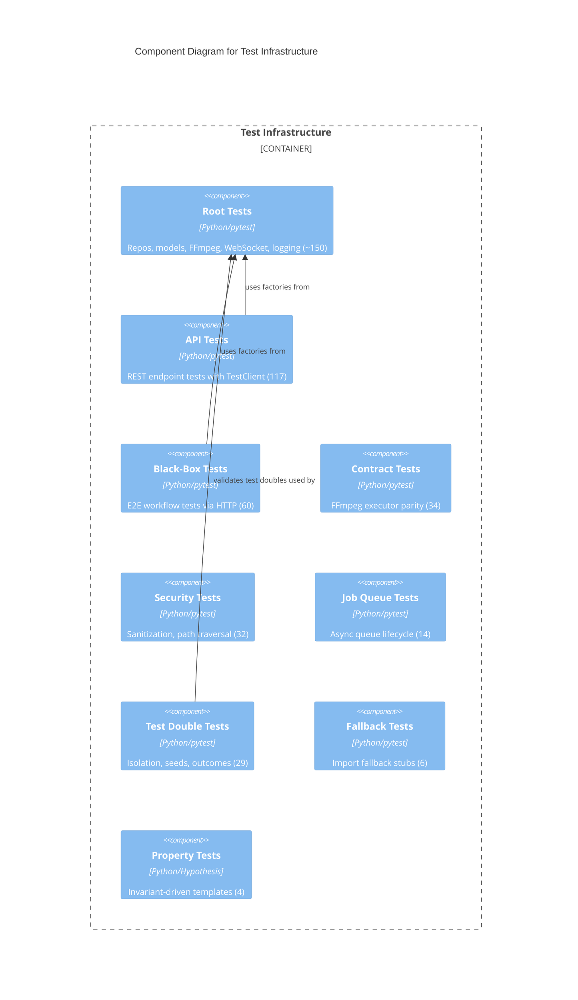

# C4 Component Level: Test Infrastructure

## Overview
- **Name**: Test Infrastructure
- **Description**: Comprehensive Python test suite covering unit, integration, contract, black-box, security, and property-based testing
- **Type**: Library
- **Technology**: Python, pytest, pytest-asyncio, Hypothesis, FastAPI TestClient

## Purpose

The Test Infrastructure provides thorough validation of all Python backend components. It is organized into specialized test suites: root-level unit tests for repositories, models, FFmpeg, and infrastructure; API endpoint tests using TestClient with in-memory doubles; black-box E2E tests exercising complete workflows through HTTP; contract tests ensuring test doubles faithfully match production implementations; security tests for input sanitization and path traversal; job queue lifecycle tests; and property-based tests using Hypothesis.

The test infrastructure establishes key patterns used across all suites: contract testing parametrized over implementations, the recording/replay pattern for FFmpeg testing, fluent test data builders (factories), and dependency injection via `create_app()` kwargs.

## Software Features
- **Repository Contract Tests**: Parametrized tests ensuring SQLite and InMemory implementations behave identically
- **API Endpoint Tests**: 117 tests covering all REST endpoints with in-memory test doubles
- **Black-Box E2E Tests**: 60 tests exercising complete workflows through HTTP without internal knowledge
- **FFmpeg Contract Tests**: Record/replay parity tests for Real/Recording/Fake executors
- **Security Tests**: 32 tests for shell injection, null bytes, path traversal, whitelist bypass
- **Job Queue Tests**: Async job lifecycle, timeout, worker cancellation
- **Test Double Validation**: Deepcopy isolation verification, seed helpers, configurable outcomes
- **Property-Based Tests**: Hypothesis-driven invariant testing for Video and Clip models
- **Import Fallback Tests**: Graceful degradation when Rust extension unavailable
- **Test Factories**: Fluent builders for Video, Project, and Clip test data

## Code Elements

This component contains:
- [c4-code-tests.md](./c4-code-tests.md) — Root tests: conftest, factories, repo contracts, models, FFmpeg, WebSocket, logging (~150 tests)
- [c4-code-tests-test-api.md](./c4-code-tests-test-api.md) — API endpoint tests with TestClient (117 tests)
- [c4-code-tests-test-blackbox.md](./c4-code-tests-test-blackbox.md) — Black-box E2E workflow tests (60 tests)
- [c4-code-tests-test-contract.md](./c4-code-tests-test-contract.md) — FFmpeg executor contract/parity tests (34 tests)
- [c4-code-tests-test-coverage.md](./c4-code-tests-test-coverage.md) — Import fallback tests for Rust extension (6 tests)
- [c4-code-tests-test-jobs.md](./c4-code-tests-test-jobs.md) — AsyncioJobQueue and worker lifecycle tests (14 tests)
- [c4-code-tests-test-doubles.md](./c4-code-tests-test-doubles.md) — In-memory repository isolation and seed tests (29 tests)
- [c4-code-tests-test-security.md](./c4-code-tests-test-security.md) — Input sanitization and path validation tests (32 tests)
- [c4-code-tests-examples.md](./c4-code-tests-examples.md) — Hypothesis property-based test templates (4 tests)

## Interfaces

### Test Execution
- **Protocol**: pytest CLI
- **Description**: Run test suites with markers for selective execution
- **Operations**:
  - `uv run pytest` — Run all tests
  - `uv run pytest -m blackbox` — Black-box tests only
  - `uv run pytest -m contract` — Contract tests only
  - `uv run pytest -m property` — Property-based tests only
  - `uv run pytest -m "requires_ffmpeg"` — Tests needing FFmpeg binary

### Test Factories
- **Protocol**: Function calls (internal to tests)
- **Description**: Fluent builders for test data
- **Operations**:
  - `make_test_video(**kwargs) -> Video` — Create video with sensible defaults
  - `ProjectFactory().with_clip().build()` — Fluent project/clip builder
  - `ApiFactory(client, repo).project().with_clip().create()` — HTTP-based test data creation

## Dependencies

### Components Used
- **API Gateway**: Tested via TestClient HTTP requests
- **Application Services**: Tested directly (scan, FFmpeg, jobs)
- **Data Access Layer**: Repository implementations tested with contract pattern
- **Python Bindings Layer**: PyO3 binding verification and fallback testing
- **Rust Core Engine**: Indirectly tested through Python bindings

### External Systems
- **pytest**: Test framework and runner
- **pytest-asyncio**: Async test support (asyncio_mode="auto")
- **Hypothesis**: Property-based testing strategies
- **FastAPI TestClient**: HTTP client for API testing
- **unittest.mock**: Mocking and patching

## Component Diagram

