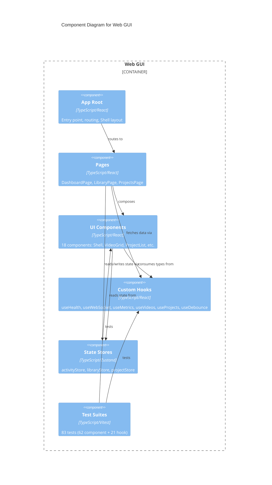

# C4 Component Level: Web GUI

## Overview
- **Name**: Web GUI
- **Description**: React single-page application providing a web-based interface for video library browsing, project management, and real-time system monitoring
- **Type**: Application
- **Technology**: TypeScript, React, Vite, Tailwind CSS, Zustand, React Router, Vitest

## Purpose

The Web GUI provides the user-facing interface for stoat-and-ferret. It is a React SPA that communicates with the backend API Gateway over HTTP and WebSocket. The application has three main views: a real-time monitoring dashboard showing system health and activity, a video library browser with search/sort/scan capabilities, and a project management interface for creating projects and managing clips.

The frontend uses Zustand for lightweight global state management, custom React hooks for data fetching and WebSocket connectivity, and Tailwind CSS for styling. It is served as static files by the backend at `/gui` and connects to the API at the same origin.

## Software Features
- **Dashboard**: Real-time health monitoring, Prometheus metrics display, WebSocket activity log
- **Video Library**: Searchable video grid with debounced search, sort controls, pagination, and directory scan modal
- **Project Management**: Project CRUD, clip timeline with timecode display, create/delete modals
- **WebSocket Integration**: Real-time event streaming with exponential backoff reconnection
- **Health Monitoring**: Polls readiness endpoint, maps to healthy/degraded/unhealthy states
- **Metrics Parsing**: Parses Prometheus text format into structured metrics display
- **State Management**: Zustand stores for activity log (FIFO), library filters, and project UI state

## Code Elements

This component contains:
- [c4-code-gui-src.md](./c4-code-gui-src.md) — App root, routing configuration (Dashboard/Library/Projects), global styles
- [c4-code-gui-components.md](./c4-code-gui-components.md) — 18 React components (Shell, Navigation, HealthIndicator, StatusBar, ActivityLog, HealthCards, MetricsCards, ScanModal, SearchBar, SortControls, VideoCard, VideoGrid, CreateProjectModal, DeleteConfirmation, ProjectCard, ProjectDetails, ProjectList)
- [c4-code-gui-hooks.md](./c4-code-gui-hooks.md) — Custom hooks (useHealth, useWebSocket, useMetrics, useDebounce, useVideos, useProjects)
- [c4-code-gui-pages.md](./c4-code-gui-pages.md) — Page components (DashboardPage, LibraryPage, ProjectsPage)
- [c4-code-gui-stores.md](./c4-code-gui-stores.md) — Zustand stores (activityStore, libraryStore, projectStore)
- [c4-code-gui-components-tests.md](./c4-code-gui-components-tests.md) — 62 component tests across 15 test files
- [c4-code-gui-hooks-tests.md](./c4-code-gui-hooks-tests.md) — 21 hook tests across 4 test files

## Interfaces

### User Interface
- **Protocol**: Web browser (HTML/CSS/JS)
- **Description**: Three-route SPA under `/gui` basename
- **Operations**:
  - `/` — Dashboard with health cards, metrics, activity log
  - `/library` — Video library with search, sort, pagination, scan
  - `/projects` — Project list, detail view, create/delete modals

### Backend API Consumption
- **Protocol**: HTTP/REST + WebSocket
- **Description**: Communicates with API Gateway for all data operations
- **Operations**:
  - `GET /health/ready` — Health polling (30s interval)
  - `GET /metrics` — Prometheus metrics polling (30s interval)
  - `WS /ws` — WebSocket for real-time events
  - `GET /api/v1/videos` — Video listing
  - `GET /api/v1/videos/search` — Video search
  - `POST /api/v1/videos/scan` — Directory scan submission
  - `GET/POST/DELETE /api/v1/projects` — Project CRUD
  - `GET /api/v1/projects/{id}/clips` — Clip listing

## Dependencies

### Components Used
- **API Gateway**: All data fetched from and sent to the backend REST/WebSocket API

### External Systems
- **React**: Component framework
- **React Router**: Client-side routing with `/gui` basename
- **Zustand**: Lightweight state management
- **Tailwind CSS**: Utility-first styling
- **Vite**: Build tool and dev server
- **Vitest**: Test framework with @testing-library/react

## Component Diagram

