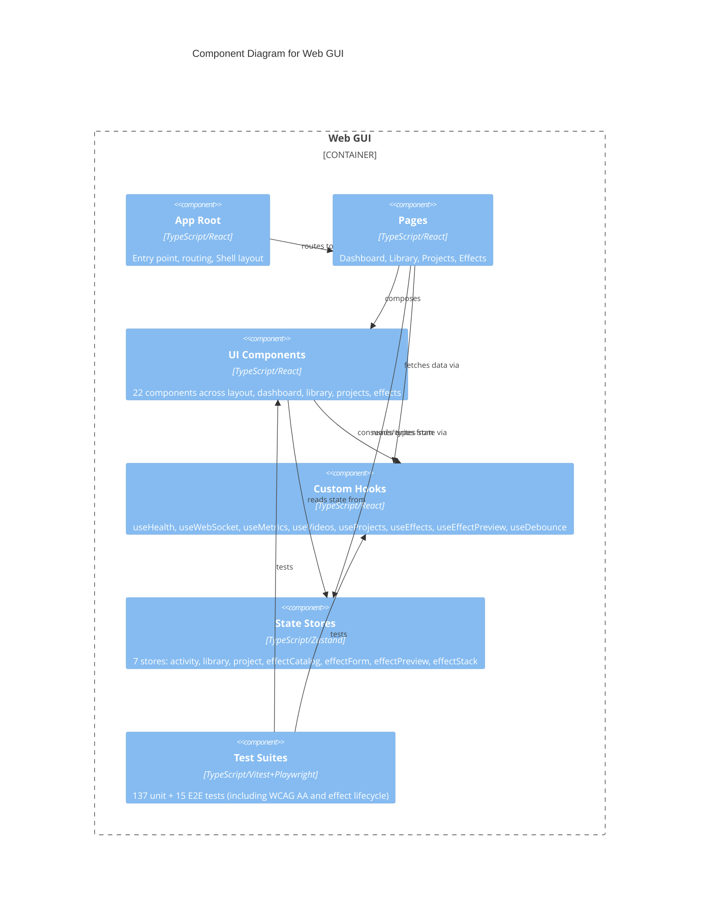

# C4 Component Level: Web GUI

## Overview
- **Name**: Web GUI
- **Description**: React single-page application providing a web-based interface for video library browsing, project management, effect workshop with schema-driven parameter forms, and real-time system monitoring
- **Type**: Application
- **Technology**: TypeScript, React, Vite, Tailwind CSS, Zustand, React Router, Vitest, Playwright

## Purpose

The Web GUI provides the user-facing interface for stoat-and-ferret. It is a React SPA that communicates with the backend API Gateway over HTTP and WebSocket. The application has four main views: a real-time monitoring dashboard showing system health and activity, a video library browser with search/sort/scan capabilities, a project management interface for creating projects and managing clips, and an effect workshop for browsing effects, configuring parameters via schema-driven forms, previewing FFmpeg filter strings, and managing effect stacks on clips.

The frontend uses Zustand for lightweight global state management (7 stores), custom React hooks for data fetching and WebSocket connectivity, and Tailwind CSS for styling. It is served as static files by the backend at `/gui` and connects to the API at the same origin.

The E2E test suite expanded significantly in v008 to cover the effect workshop lifecycle (apply, edit, remove), accessibility compliance via WCAG AA audits with axe-core, and keyboard navigation through the full effect workflow.

## Software Features
- **Dashboard**: Real-time health monitoring, Prometheus metrics display, WebSocket activity log
- **Video Library**: Searchable video grid with debounced search, sort controls, pagination, and directory scan modal
- **Project Management**: Project CRUD, clip timeline with timecode display, create/delete modals
- **Effect Workshop**: Effect catalog browsing with search/category filter, schema-driven parameter forms, real-time filter preview with syntax highlighting, effect apply/edit/remove lifecycle, and effect stack visualization
- **WebSocket Integration**: Real-time event streaming with exponential backoff reconnection
- **Health Monitoring**: Polls readiness endpoint, maps to healthy/degraded/unhealthy states
- **Metrics Parsing**: Parses Prometheus text format into structured metrics display
- **State Management**: 7 Zustand stores for activity log, library filters, project UI, effect catalog, form, preview, and stack
- **Accessibility**: WCAG 2.0 Level AA compliance verified via axe-core Playwright integration

## Code Elements

This component contains:
- [c4-code-gui-src.md](./c4-code-gui-src.md) -- App root, routing (Dashboard/Library/Projects/Effects), global styles
- [c4-code-gui-components.md](./c4-code-gui-components.md) -- 22 React components: layout (Shell, Navigation, StatusBar), dashboard (HealthIndicator, HealthCards, MetricsCards, ActivityLog), library (SearchBar, SortControls, VideoCard, VideoGrid, ScanModal), projects (ProjectCard, ProjectList, ProjectDetails, CreateProjectModal, DeleteConfirmation), effects (EffectCatalog, EffectParameterForm, FilterPreview, ClipSelector, EffectStack)
- [c4-code-gui-hooks.md](./c4-code-gui-hooks.md) -- 8 custom hooks: useHealth, useWebSocket, useMetrics, useDebounce, useVideos, useProjects, useEffects, useEffectPreview
- [c4-code-gui-pages.md](./c4-code-gui-pages.md) -- 4 pages: DashboardPage, LibraryPage, ProjectsPage, EffectsPage
- [c4-code-gui-stores.md](./c4-code-gui-stores.md) -- 7 Zustand stores: activityStore, libraryStore, projectStore, effectCatalogStore, effectFormStore, effectPreviewStore, effectStackStore
- [c4-code-gui-components-tests.md](./c4-code-gui-components-tests.md) -- 101 component tests across 20 test files
- [c4-code-gui-hooks-tests.md](./c4-code-gui-hooks-tests.md) -- 30 hook tests across 6 test files
- [c4-code-gui-stores-tests.md](./c4-code-gui-stores-tests.md) -- 6 Zustand store tests: clipStore CRUD operations, API error handling
- [c4-code-gui-e2e.md](./c4-code-gui-e2e.md) -- 15 Playwright E2E tests: navigation, scan, project creation, accessibility (WCAG AA, 5 tests), effect workshop lifecycle (7 tests covering apply/edit/remove and keyboard navigation)

## Interfaces

### User Interface
- **Protocol**: Web browser (HTML/CSS/JS)
- **Description**: Four-route SPA under `/gui` basename
- **Operations**:
  - `/` -- Dashboard with health cards, metrics, activity log
  - `/library` -- Video library with search, sort, pagination, scan
  - `/projects` -- Project list, detail view, create/delete modals
  - `/effects` -- Effect catalog, parameter form, filter preview, effect stack

### Backend API Consumption
- **Protocol**: HTTP/REST + WebSocket
- **Key Operations**:
  - `GET /health/ready` -- Health polling (30s interval)
  - `GET /metrics` -- Prometheus metrics polling (30s interval)
  - `WS /ws` -- WebSocket for real-time events
  - `GET /api/v1/videos` -- Video listing and search
  - `GET/POST/DELETE /api/v1/projects` -- Project CRUD
  - `GET /api/v1/projects/{id}/clips` -- Clip listing
  - `GET /api/v1/effects` -- Effect discovery
  - `POST /api/v1/effects/preview` -- Filter preview
  - `POST /api/v1/projects/{id}/clips/{id}/effects` -- Apply effect
  - `PATCH /api/v1/projects/{id}/clips/{id}/effects/{idx}` -- Update effect
  - `DELETE /api/v1/projects/{id}/clips/{id}/effects/{idx}` -- Remove effect

## Dependencies

### Components Used
- **API Gateway**: All data fetched from and sent to the backend REST/WebSocket API

### External Systems
- **React**: Component framework
- **React Router**: Client-side routing with `/gui` basename
- **Zustand**: Lightweight state management (7 stores)
- **Tailwind CSS**: Utility-first styling
- **Vite**: Build tool and dev server
- **Vitest**: Unit test framework with @testing-library/react
- **Playwright**: E2E test framework with axe-core accessibility audits

## Component Diagram

