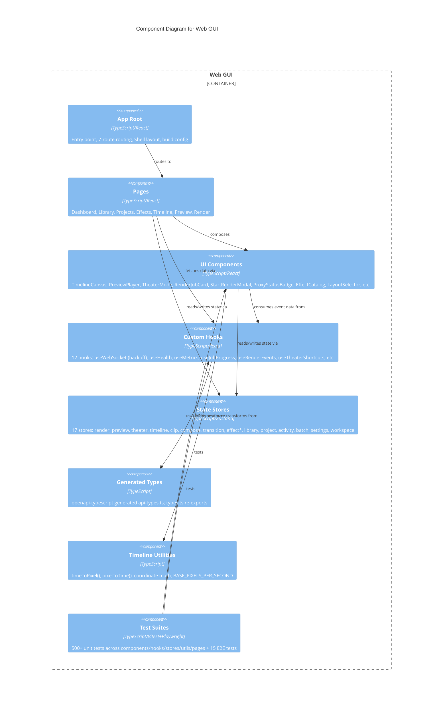

# C4 Component Level: Web GUI

## Overview
- **Name**: Web GUI
- **Description**: React single-page application providing a web-based interface for video library browsing, project management, effect workshop with schema-driven parameter forms, and real-time system monitoring
- **Type**: Application
- **Technology**: TypeScript, React, Vite, Tailwind CSS, Zustand, React Router, Vitest, Playwright

## Purpose

The Web GUI provides the user-facing interface for stoat-and-ferret. It is a React SPA that communicates with the backend API Gateway over HTTP and WebSocket. The application has four main views: a real-time monitoring dashboard showing system health and activity, a video library browser with search/sort/scan capabilities, a project management interface for creating projects and managing clips, and an effect workshop for browsing effects, configuring parameters via schema-driven forms, previewing FFmpeg filter strings, and managing effect stacks on clips.

The frontend uses Zustand for lightweight global state management (17 stores), custom React hooks for data fetching and WebSocket connectivity, and Tailwind CSS for styling. It is served as static files by the backend at `/gui` and connects to the API at the same origin.

The E2E test suite expanded significantly in v008 to cover the effect workshop lifecycle (apply, edit, remove), accessibility compliance via WCAG AA audits with axe-core, and keyboard navigation through the full effect workflow.

## Software Features
- **Dashboard**: Real-time health monitoring, Prometheus metrics display, WebSocket activity log
- **Video Library**: Searchable video grid with debounced search, sort controls, pagination, and directory scan modal; ProxyStatusBadge for proxy generation status
- **Project Management**: Project CRUD, clip timeline with timecode display, create/delete modals
- **Effect Workshop**: Effect catalog browsing with search/category filter, schema-driven parameter forms, real-time filter preview with syntax highlighting, effect apply/edit/remove lifecycle, and effect stack visualization
- **Render UI**: StatusBadge for job states, RenderJobCard with ETA/speed/progress, StartRenderModal with encoder/format/quality selection and debounced preview
- **Preview & Theater**: HLS.js video player, PlayerControls, TheaterMode with HUD auto-hide, AIActionIndicator
- **Timeline Editing**: TimelineCanvas with Track, TimelineClip, TimeRuler, Playhead; AudioWaveform visualization; LayoutSelector for composition presets
- **WebSocket Integration**: Real-time event streaming with exponential backoff reconnection (1s→30s)
- **Health Monitoring**: Polls readiness endpoint, maps to healthy/degraded/unhealthy states
- **Metrics Parsing**: Parses Prometheus text format into structured metrics display
- **State Management**: 17 Zustand stores including renderStore, previewStore, theaterStore, timelineStore, transitionStore, batchStore, settingsStore, workspaceStore
- **OpenAPI Types**: Generated TypeScript types from OpenAPI spec via openapi-typescript
- **Timeline Utilities**: timeToPixel(), pixelToTime(), getMarkerInterval(), BASE_PIXELS_PER_SECOND
- **Accessibility**: WCAG 2.0 Level AA compliance verified via axe-core Playwright integration

## Code Elements

This component contains:
- [c4-code-gui.md](./c4-code-gui.md) -- Build config: vite.config.ts, vitest.config.ts, playwright.config.ts, tsconfig, package.json (React 19, Zustand 5, HLS.js)
- [c4-code-gui-src.md](./c4-code-gui-src.md) -- App root, 7-route routing (Dashboard/Library/Projects/Effects/Timeline/Preview/Render), global styles
- [c4-code-gui-generated.md](./c4-code-gui-generated.md) -- api-types.ts from openapi-typescript; types.ts re-exports (Effect, Project, Clip, Video, Track, LayoutPosition, etc.)
- [c4-code-gui-components.md](./c4-code-gui-components.md) -- Main React components: Shell, Navigation, TimelineCanvas, Track, TimelineClip, TimeRuler, Playhead, AudioWaveform, PreviewPlayer, PlayerControls, ProgressBar, VolumeSlider, ProjectList, EffectCatalog, EffectStack, LayoutSelector, VideoGrid, etc.
- [c4-code-gui-components-library.md](./c4-code-gui-components-library.md) -- ProxyStatusBadge component for proxy generation status
- [c4-code-gui-components-render.md](./c4-code-gui-components-render.md) -- StatusBadge, RenderJobCard (progress/ETA/speed), StartRenderModal (encoder/format/quality + debounced preview)
- [c4-code-gui-components-theater.md](./c4-code-gui-components-theater.md) -- TheaterMode with HUD auto-hide (3s), TopHUD (project title + AI action), BottomHUD (render progress + controls), AIActionIndicator
- [c4-code-gui-hooks.md](./c4-code-gui-hooks.md) -- 12 hooks: useHealth, useWebSocket (exponential backoff 1s→30s), useMetrics, useDebounce, useVideos, useProjects, useEffects, useEffectPreview, useFullscreen, useTheaterShortcuts, useTimelineSync, useJobProgress, useRenderEvents
- [c4-code-gui-pages.md](./c4-code-gui-pages.md) -- 7 pages: DashboardPage, LibraryPage, ProjectsPage, EffectsPage, TimelinePage, PreviewPage, RenderPage
- [c4-code-gui-stores.md](./c4-code-gui-stores.md) -- 17 Zustand stores: activityStore, batchStore, clipStore, composeStore, effectCatalogStore, effectFormStore, effectPreviewStore, effectStackStore, libraryStore, previewStore, projectStore, renderStore, settingsStore, theaterStore, timelineStore, transitionStore, workspaceStore
- [c4-code-gui-utils.md](./c4-code-gui-utils.md) -- timeToPixel(), pixelToTime(), getMarkerInterval(), formatRulerTime(), BASE_PIXELS_PER_SECOND=100
- [c4-code-gui-src-tests.md](./c4-code-gui-src-tests.md) -- MockWebSocket utility class for hook/component tests
- [c4-code-gui-components-tests.md](./c4-code-gui-components-tests.md) -- 318 component tests across 38 test files covering all main components
- [c4-code-gui-components-library-tests.md](./c4-code-gui-components-library-tests.md) -- 7 tests for ProxyStatusBadge
- [c4-code-gui-components-render-tests.md](./c4-code-gui-components-render-tests.md) -- 48 tests for StatusBadge, RenderJobCard, StartRenderModal
- [c4-code-gui-components-theater-tests.md](./c4-code-gui-components-theater-tests.md) -- 26 tests for TheaterMode, TopHUD, BottomHUD
- [c4-code-gui-hooks-tests.md](./c4-code-gui-hooks-tests.md) -- 82 tests for 14 hooks
- [c4-code-gui-pages-tests.md](./c4-code-gui-pages-tests.md) -- 23 tests for PreviewPage and RenderPage
- [c4-code-gui-utils-tests.md](./c4-code-gui-utils-tests.md) -- 24 tests for timeline coordinate utilities
- [c4-code-gui-stores-tests.md](./c4-code-gui-stores-tests.md) -- Zustand store tests: clipStore CRUD operations, API error handling
- [c4-code-gui-e2e.md](./c4-code-gui-e2e.md) -- 15 Playwright E2E tests: navigation, scan, project creation, accessibility (WCAG AA), effects workflow

## Interfaces

### User Interface
- **Protocol**: Web browser (HTML/CSS/JS)
- **Description**: Seven-route SPA under `/gui` basename
- **Operations**:
  - `/` -- Dashboard with health cards, metrics, activity log
  - `/library` -- Video library with search, sort, pagination, scan
  - `/projects` -- Project list, detail view, create/delete modals
  - `/effects` -- Effect catalog, parameter form, filter preview, effect stack
  - `/timeline` -- Timeline editor with tracks, clips, audio waveform, ruler
  - `/preview` -- HLS.js video preview with theater mode
  - `/render` -- Render job management with progress/ETA/speed

### Backend API Consumption
- **Protocol**: HTTP/REST + WebSocket
- **Key Operations**:
  - `GET /health/ready` -- Health polling (30s interval)
  - `GET /metrics` -- Prometheus metrics polling (30s interval)
  - `WS /ws` -- WebSocket for real-time events
  - `GET /api/v1/videos` -- Video listing and search
  - `GET/POST/DELETE /api/v1/projects` -- Project CRUD
  - `GET /api/v1/projects/{id}/clips` -- Clip listing
  - `GET /api/v1/effects` -- Effect discovery
  - `POST /api/v1/effects/preview` -- Filter preview
  - `POST /api/v1/projects/{id}/clips/{id}/effects` -- Apply effect
  - `PATCH /api/v1/projects/{id}/clips/{id}/effects/{idx}` -- Update effect
  - `DELETE /api/v1/projects/{id}/clips/{id}/effects/{idx}` -- Remove effect

## Dependencies

### Components Used
- **API Gateway**: All data fetched from and sent to the backend REST/WebSocket API

### External Systems
- **React**: Component framework
- **React Router**: Client-side routing with `/gui` basename
- **Zustand**: Lightweight state management (17 stores)
- **Tailwind CSS**: Utility-first styling
- **Vite**: Build tool and dev server
- **Vitest**: Unit test framework with @testing-library/react
- **Playwright**: E2E test framework with axe-core accessibility audits

## Component Diagram

```mermaid
C4Component
    title Component Diagram for Web GUI

    Container_Boundary(gui, "Web GUI") {
        Component(app_root, "App Root", "TypeScript/React", "Entry point, 7-route routing, Shell layout, build config")
        Component(pages, "Pages", "TypeScript/React", "Dashboard, Library, Projects, Effects, Timeline, Preview, Render")
        Component(components, "UI Components", "TypeScript/React", "TimelineCanvas, PreviewPlayer, TheaterMode, RenderJobCard, StartRenderModal, ProxyStatusBadge, EffectCatalog, LayoutSelector, etc.")
        Component(hooks, "Custom Hooks", "TypeScript/React", "12 hooks: useWebSocket (backoff), useHealth, useMetrics, useJobProgress, useRenderEvents, useTheaterShortcuts, etc.")
        Component(stores, "State Stores", "TypeScript/Zustand", "17 stores: render, preview, theater, timeline, clip, compose, transition, effect*, library, project, activity, batch, settings, workspace")
        Component(generated, "Generated Types", "TypeScript", "openapi-typescript generated api-types.ts; types.ts re-exports")
        Component(utils, "Timeline Utilities", "TypeScript", "timeToPixel(), pixelToTime(), coordinate math, BASE_PIXELS_PER_SECOND")
        Component(gui_tests, "Test Suites", "TypeScript/Vitest+Playwright", "500+ unit tests across components/hooks/stores/utils/pages + 15 E2E tests")
    }

    Rel(app_root, pages, "routes to")
    Rel(pages, components, "composes")
    Rel(pages, hooks, "fetches data via")
    Rel(pages, stores, "reads/writes state via")
    Rel(components, hooks, "consumes event data from")
    Rel(components, stores, "reads/writes state via")
    Rel(components, utils, "uses coordinate transforms from")
    Rel(hooks, generated, "uses API types from")
    Rel(gui_tests, components, "tests")
    Rel(gui_tests, hooks, "tests")
```
