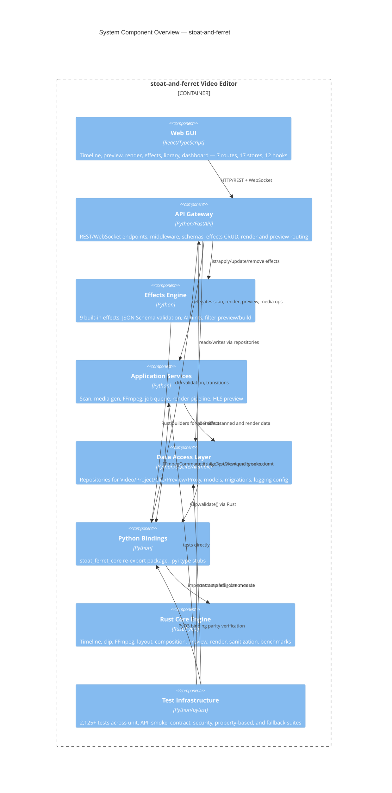

# C4 Component Level: System Overview

## System Components

| Component | Description | Code Elements | Documentation |
|-----------|-------------|---------------|---------------|
| Rust Core Engine | Frame-accurate timeline math, clip validation, FFmpeg command building, filter graphs, audio/transition builders, layout, composition, preview optimization, render planning, sanitization, and benchmarks | 13 files | [c4-component-rust-core-engine.md](./c4-component-rust-core-engine.md) |
| Python Bindings Layer | Python re-export package and manually maintained type stubs bridging the Rust core to Python | 2 files | [c4-component-python-bindings.md](./c4-component-python-bindings.md) |
| Effects Engine | Effect definition registry with 9 built-in effects, JSON Schema validation, AI hints, and filter preview/build functions | 2 files | [c4-component-effects-engine.md](./c4-component-effects-engine.md) |
| API Gateway | FastAPI REST/WebSocket endpoints, middleware, schemas, effects CRUD, transitions, render and preview routing | 7 files | [c4-component-api-gateway.md](./c4-component-api-gateway.md) |
| Application Services | Video scanning, media generation (thumbnails/waveforms/proxies), FFmpeg execution, job queue, render pipeline, HLS preview system, dev scripts | 7 files | [c4-component-application-services.md](./c4-component-application-services.md) |
| Data Access Layer | SQLite repository pattern for Video/Project/Clip/Preview/Proxy; domain models; Alembic migrations; structured logging configuration | 6 files | [c4-component-data-access.md](./c4-component-data-access.md) |
| Web GUI | React SPA with timeline editor, HLS preview player, render UI, effect workshop, dashboard, video library, project management, 17 Zustand stores, 12 hooks | 21 files | [c4-component-web-gui.md](./c4-component-web-gui.md) |
| Test Infrastructure | Python test suites: unit, API integration, smoke, black-box, contract, security, job queue, test doubles, property-based, and import fallback testing | 11 files | [c4-component-test-infrastructure.md](./c4-component-test-infrastructure.md) |

## Component Relationships

```mermaid
C4Component
    title System Component Overview — stoat-and-ferret

    Container_Boundary(system, "stoat-and-ferret Video Editor") {
        Component(gui, "Web GUI", "React/TypeScript", "Timeline, preview, render, effects, library, dashboard — 7 routes, 17 stores, 12 hooks")
        Component(api, "API Gateway", "Python/FastAPI", "REST/WebSocket endpoints, middleware, schemas, effects CRUD, render and preview routing")
        Component(effects, "Effects Engine", "Python", "9 built-in effects, JSON Schema validation, AI hints, filter preview/build")
        Component(services, "Application Services", "Python", "Scan, media gen, FFmpeg, job queue, render pipeline, HLS preview")
        Component(data, "Data Access Layer", "Python/SQLite/Alembic", "Repositories for Video/Project/Clip/Preview/Proxy, models, migrations, logging config")
        Component(bindings, "Python Bindings", "Python", "stoat_ferret_core re-export package, .pyi type stubs")
        Component(rust, "Rust Core Engine", "Rust/PyO3", "Timeline, clip, FFmpeg, layout, composition, preview, render, sanitization, benchmarks")
        Component(tests, "Test Infrastructure", "Python/pytest", "2,125+ tests across unit, API, smoke, contract, security, property-based, and fallback suites")
    }

    Rel(gui, api, "HTTP/REST + WebSocket")
    Rel(api, effects, "list/apply/update/remove effects")
    Rel(api, services, "delegates scan, render, preview, media ops")
    Rel(api, data, "reads/writes via repositories")
    Rel(api, bindings, "clip validation, transitions")
    Rel(effects, bindings, "Rust builders for all 9 effects")
    Rel(services, data, "persists scanned and render data")
    Rel(services, bindings, "FFmpegCommand bridge, preview quality selection")
    Rel(data, bindings, "Clip.validate() via Rust")
    Rel(bindings, rust, "imports compiled _core module")
    Rel(tests, api, "tests via TestClient and smoke client")
    Rel(tests, services, "tests directly")
    Rel(tests, data, "contract and isolation tests")
    Rel(tests, bindings, "PyO3 binding parity verification")
```

## Component-to-Code Mapping

| Code-Level File | Component |
|-----------------|-----------|
| `c4-code-rust-core` | Rust Core Engine |
| `c4-code-rust-ffmpeg` | Rust Core Engine |
| `c4-code-rust-stoat-ferret-core-src` | Rust Core Engine |
| `c4-code-rust-stoat-ferret-core-timeline` | Rust Core Engine |
| `c4-code-rust-stoat-ferret-core-clip` | Rust Core Engine |
| `c4-code-rust-stoat-ferret-core-ffmpeg` | Rust Core Engine |
| `c4-code-rust-stoat-ferret-core-sanitize` | Rust Core Engine |
| `c4-code-rust-stoat-ferret-core-layout` | Rust Core Engine |
| `c4-code-rust-stoat-ferret-core-compose` | Rust Core Engine |
| `c4-code-rust-stoat-ferret-core-preview` | Rust Core Engine |
| `c4-code-rust-stoat-ferret-core-render` | Rust Core Engine |
| `c4-code-rust-stoat-ferret-core-benches` | Rust Core Engine |
| `c4-code-rust-stoat-ferret-core-bin` | Rust Core Engine |
| `c4-code-stoat-ferret-core` | Python Bindings Layer |
| `c4-code-stubs-stoat-ferret-core` | Python Bindings Layer |
| `c4-code-python-effects` | Effects Engine |
| `c4-code-stoat-ferret-effects` | Effects Engine |
| `c4-code-stoat-ferret-api` | API Gateway |
| `c4-code-python-api` | API Gateway |
| `c4-code-stoat-ferret-api-routers` | API Gateway |
| `c4-code-stoat-ferret-api-middleware` | API Gateway |
| `c4-code-stoat-ferret-api-schemas` | API Gateway |
| `c4-code-python-schemas` | API Gateway |
| `c4-code-stoat-ferret-api-websocket` | API Gateway |
| `c4-code-websocket-identity` | API Gateway |
| `c4-code-stoat-ferret-api-services` | Application Services |
| `c4-code-stoat-ferret-ffmpeg` | Application Services |
| `c4-code-stoat-ferret-jobs` | Application Services |
| `c4-code-stoat-ferret-render` | Application Services |
| `c4-code-stoat-ferret-preview` | Application Services |
| `c4-code-benchmarks` | Application Services |
| `c4-code-scripts` | Application Services |
| `c4-code-stoat-ferret-db` | Data Access Layer |
| `c4-code-python-db` | Data Access Layer |
| `c4-code-stoat-ferret-db-new` | Data Access Layer |
| `c4-code-alembic` | Data Access Layer |
| `c4-code-alembic-versions` | Data Access Layer |
| `c4-code-stoat-ferret` | Data Access Layer |
| `c4-code-gui` | Web GUI |
| `c4-code-gui-src` | Web GUI |
| `c4-code-gui-generated` | Web GUI |
| `c4-code-gui-components` | Web GUI |
| `c4-code-gui-components-library` | Web GUI |
| `c4-code-gui-components-render` | Web GUI |
| `c4-code-gui-components-theater` | Web GUI |
| `c4-code-gui-hooks` | Web GUI |
| `c4-code-gui-pages` | Web GUI |
| `c4-code-gui-stores` | Web GUI |
| `c4-code-gui-utils` | Web GUI |
| `c4-code-gui-src-tests` | Web GUI |
| `c4-code-gui-components-tests` | Web GUI |
| `c4-code-gui-components-library-tests` | Web GUI |
| `c4-code-gui-components-render-tests` | Web GUI |
| `c4-code-gui-components-theater-tests` | Web GUI |
| `c4-code-gui-hooks-tests` | Web GUI |
| `c4-code-gui-pages-tests` | Web GUI |
| `c4-code-gui-utils-tests` | Web GUI |
| `c4-code-gui-stores-tests` | Web GUI |
| `c4-code-gui-e2e` | Web GUI |
| `c4-code-tests` | Test Infrastructure |
| `c4-code-tests-test-api` | Test Infrastructure |
| `c4-code-tests-smoke` | Test Infrastructure |
| `c4-code-tests-test-blackbox` | Test Infrastructure |
| `c4-code-tests-test-contract` | Test Infrastructure |
| `c4-code-tests-unit` | Test Infrastructure |
| `c4-code-tests-test-security` | Test Infrastructure |
| `c4-code-tests-test-jobs` | Test Infrastructure |
| `c4-code-tests-test-doubles` | Test Infrastructure |
| `c4-code-tests-test-coverage` | Test Infrastructure |
| `c4-code-tests-examples` | Test Infrastructure |
