# C4 Component Level: System Overview

## System Components

| Component | Description | Code Elements | Documentation |
|-----------|-------------|---------------|---------------|
| Rust Core Engine | Frame-accurate timeline math, clip validation, FFmpeg command building, input sanitization | 6 files | [c4-component-rust-core-engine.md](./c4-component-rust-core-engine.md) |
| Python Bindings Layer | Python re-export package, type stubs, and stub verification for Rust core | 3 files | [c4-component-python-bindings.md](./c4-component-python-bindings.md) |
| API Gateway | FastAPI REST/WebSocket endpoints, middleware, schemas, and configuration | 5 files | [c4-component-api-gateway.md](./c4-component-api-gateway.md) |
| Application Services | Video scanning, thumbnail generation, FFmpeg execution, async job queue | 3 files | [c4-component-application-services.md](./c4-component-application-services.md) |
| Data Access Layer | SQLite repository pattern, domain models, schema, audit logging, structured logging | 2 files | [c4-component-data-access.md](./c4-component-data-access.md) |
| Web GUI | React SPA with dashboard, video library, project management, and real-time monitoring | 7 files | [c4-component-web-gui.md](./c4-component-web-gui.md) |
| Test Infrastructure | Unit, integration, contract, black-box, security, and property-based test suites | 9 files | [c4-component-test-infrastructure.md](./c4-component-test-infrastructure.md) |

## Component Relationships

```mermaid
C4Component
    title System Component Overview — stoat-and-ferret

    Container_Boundary(system, "stoat-and-ferret Video Editor") {
        Component(gui, "Web GUI", "React/TypeScript", "Dashboard, library, project management")
        Component(api, "API Gateway", "Python/FastAPI", "REST/WebSocket endpoints, middleware")
        Component(services, "Application Services", "Python", "Scan, thumbnail, FFmpeg, job queue")
        Component(data, "Data Access Layer", "Python/SQLite", "Repositories, models, audit, logging")
        Component(bindings, "Python Bindings", "Python", "Re-exports, type stubs, verification")
        Component(rust, "Rust Core Engine", "Rust/PyO3", "Timeline math, validation, commands, sanitization")
        Component(tests, "Test Infrastructure", "Python/pytest", "~450 tests across 7 suites")
    }

    Rel(gui, api, "HTTP/REST + WebSocket")
    Rel(api, services, "delegates business logic")
    Rel(api, data, "reads/writes via repos")
    Rel(api, bindings, "clip validation")
    Rel(services, data, "persists scanned data")
    Rel(services, bindings, "FFmpegCommand bridge")
    Rel(data, bindings, "Clip.validate()")
    Rel(bindings, rust, "imports compiled _core module")
    Rel(tests, api, "tests via TestClient")
    Rel(tests, services, "tests directly")
    Rel(tests, data, "contract tests")
    Rel(tests, bindings, "binding verification")
```

## Component-to-Code Mapping

| Code-Level File | Component |
|-----------------|-----------|
| `c4-code-rust-stoat-ferret-core-src` | Rust Core Engine |
| `c4-code-rust-stoat-ferret-core-timeline` | Rust Core Engine |
| `c4-code-rust-stoat-ferret-core-clip` | Rust Core Engine |
| `c4-code-rust-stoat-ferret-core-ffmpeg` | Rust Core Engine |
| `c4-code-rust-stoat-ferret-core-sanitize` | Rust Core Engine |
| `c4-code-rust-stoat-ferret-core-bin` | Rust Core Engine |
| `c4-code-stoat-ferret-core` | Python Bindings Layer |
| `c4-code-stubs-stoat-ferret-core` | Python Bindings Layer |
| `c4-code-scripts` | Python Bindings Layer |
| `c4-code-stoat-ferret-api` | API Gateway |
| `c4-code-stoat-ferret-api-routers` | API Gateway |
| `c4-code-stoat-ferret-api-middleware` | API Gateway |
| `c4-code-stoat-ferret-api-schemas` | API Gateway |
| `c4-code-stoat-ferret-api-websocket` | API Gateway |
| `c4-code-stoat-ferret-api-services` | Application Services |
| `c4-code-stoat-ferret-ffmpeg` | Application Services |
| `c4-code-stoat-ferret-jobs` | Application Services |
| `c4-code-stoat-ferret-db` | Data Access Layer |
| `c4-code-stoat-ferret` | Data Access Layer |
| `c4-code-gui-src` | Web GUI |
| `c4-code-gui-components` | Web GUI |
| `c4-code-gui-hooks` | Web GUI |
| `c4-code-gui-pages` | Web GUI |
| `c4-code-gui-stores` | Web GUI |
| `c4-code-gui-components-tests` | Web GUI |
| `c4-code-gui-hooks-tests` | Web GUI |
| `c4-code-tests` | Test Infrastructure |
| `c4-code-tests-test-api` | Test Infrastructure |
| `c4-code-tests-test-blackbox` | Test Infrastructure |
| `c4-code-tests-test-contract` | Test Infrastructure |
| `c4-code-tests-test-coverage` | Test Infrastructure |
| `c4-code-tests-test-jobs` | Test Infrastructure |
| `c4-code-tests-test-doubles` | Test Infrastructure |
| `c4-code-tests-test-security` | Test Infrastructure |
| `c4-code-tests-examples` | Test Infrastructure |
