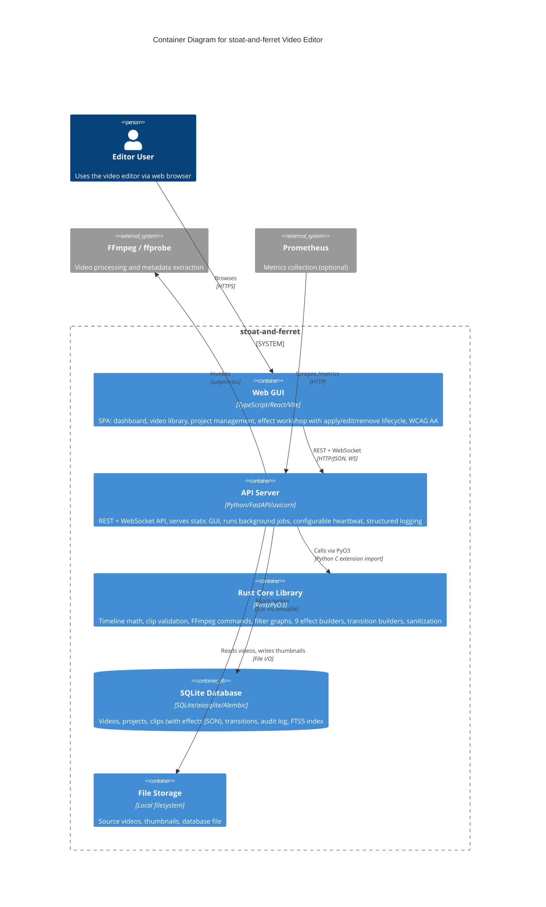

# C4 Container Level: System Deployment

## Container Diagram

## Containers

### API Server

- **Name**: API Server
- **Description**: The FastAPI backend that hosts the REST API, WebSocket endpoint, background job worker, effects registry with full CRUD, transition engine, and serves the built GUI as static files. This is the single running process for the application. Structured logging is wired into the application lifespan on startup, and the WebSocket heartbeat interval is configurable via the `ws_heartbeat_interval` setting.
- **Type**: API / Web Application
- **Technology**: Python 3.10+, FastAPI, uvicorn, Starlette, Pydantic, asyncio, structlog, prometheus-client, jsonschema
- **Deployment**: `python -m stoat_ferret.api` (uvicorn on port 8000). Dockerfile available for containerized testing.

#### Components Deployed

- [API Gateway](./c4-component-api-gateway.md) -- REST/WebSocket endpoints, middleware, schemas, settings (`ws_heartbeat_interval`, `debug`, `allowed_scan_roots`), effects/transitions router
- [Effects Engine](./c4-component-effects-engine.md) -- EffectRegistry with 9 built-in effects (text overlay, speed, volume, audio fade, audio mix, audio ducking, video fade, crossfade, audio crossfade), JSON Schema validation, AI hints
- [Application Services](./c4-component-application-services.md) -- Scan service, thumbnail generation, FFmpeg execution, job queue
- [Data Access Layer](./c4-component-data-access.md) -- Repository pattern, domain models (effects/transitions as JSON), schema, audit logging, `configure_logging()` wired into lifespan
- [Python Bindings Layer](./c4-component-python-bindings.md) -- Re-exports from Rust core, type stubs

#### Interfaces

- **REST API**: HTTP/JSON -- [OpenAPI spec](./apis/api-server-api.yaml)
  - `GET /health/live` -- Liveness probe
  - `GET /health/ready` -- Readiness probe (DB + FFmpeg checks)
  - `GET /api/v1/videos` -- List videos with pagination
  - `GET /api/v1/videos/search` -- Search videos by filename/path (FTS5)
  - `GET /api/v1/videos/{video_id}` -- Get video by ID
  - `GET /api/v1/videos/{video_id}/thumbnail` -- Get thumbnail image
  - `POST /api/v1/videos/scan` -- Submit directory scan job
  - `DELETE /api/v1/videos/{video_id}` -- Delete video
  - `GET /api/v1/projects` -- List projects
  - `POST /api/v1/projects` -- Create project
  - `GET /api/v1/projects/{project_id}` -- Get project
  - `DELETE /api/v1/projects/{project_id}` -- Delete project
  - `GET /api/v1/projects/{project_id}/clips` -- List clips in project
  - `POST /api/v1/projects/{project_id}/clips` -- Add clip to project
  - `PATCH /api/v1/projects/{project_id}/clips/{clip_id}` -- Update clip
  - `DELETE /api/v1/projects/{project_id}/clips/{clip_id}` -- Delete clip
  - `GET /api/v1/jobs/{job_id}` -- Get job status
  - `GET /api/v1/effects` -- List all 9 effects with parameter schemas and AI hints
  - `POST /api/v1/effects/preview` -- Preview filter string without applying
  - `POST /api/v1/projects/{project_id}/clips/{clip_id}/effects` -- Apply effect to clip
  - `PATCH /api/v1/projects/{project_id}/clips/{clip_id}/effects/{index}` -- Update effect at index
  - `DELETE /api/v1/projects/{project_id}/clips/{clip_id}/effects/{index}` -- Remove effect at index
  - `POST /api/v1/projects/{project_id}/effects/transition` -- Apply transition between adjacent clips
- **WebSocket**: WS/JSON at `/ws` -- Real-time events (HEALTH_STATUS, SCAN_STARTED, SCAN_COMPLETED, PROJECT_CREATED, HEARTBEAT) with configurable `ws_heartbeat_interval` (default 30s, wired from settings on startup)
- **Prometheus Metrics**: HTTP at `/metrics` -- Request count, duration histograms, effect/transition application counters
- **Static GUI**: HTTP at `/gui` -- Serves built React SPA assets

#### Dependencies

- **SQLite Database**: SQL via aiosqlite (in-process connection)
- **File Storage**: Reads source video files, writes thumbnails to `data/thumbnails/`
- **Rust Core Library**: PyO3 import for clip validation, FFmpeg command building, all 9 effect builders (DrawtextBuilder, SpeedControl, VolumeBuilder, AfadeBuilder, AmixBuilder, DuckingPattern, FadeBuilder, XfadeBuilder, AcrossfadeBuilder), TransitionType, sanitization
- **FFmpeg / ffprobe**: Subprocess invocation for video processing and metadata extraction
- **Prometheus** (optional): Scrapes `/metrics` endpoint

#### Build Output

- **Docker image**: Multi-stage Dockerfile -- Stage 1 compiles Rust extension with maturin, Stage 2 creates slim Python runtime with uv
- **Entry point**: `python -m stoat_ferret.api` or `uvicorn stoat_ferret.api.app:create_app`
- **Settings**: Environment variables with `STOAT_` prefix (host, port, database path, scan roots, GUI static path, `ws_heartbeat_interval`, `debug`, log level)
- **Scaling**: Single-process; horizontal scaling not supported (SQLite file-based, in-process job queue)

#### Infrastructure References

- **Dockerfile**: [Dockerfile](../../Dockerfile) -- Multi-stage build (builder + runtime)
- **docker-compose.yml**: [docker-compose.yml](../../docker-compose.yml) -- Test service with source mounts
- **CI**: [.github/workflows/ci.yml](../../.github/workflows/ci.yml) -- 9-matrix test (3 OS x 3 Python), Rust coverage, E2E tests

---

### Web GUI

- **Name**: Web GUI
- **Description**: React single-page application built with Vite, served as static files by the API Server. In development, runs as a separate Vite dev server with API proxy. In v008, the effect workshop was fully implemented with apply/edit/remove lifecycle, WCAG AA accessibility compliance verified via axe-core Playwright integration, and the E2E suite expanded to 15 tests.
- **Type**: Web Application (SPA)
- **Technology**: TypeScript, React 19, Vite 7, Tailwind CSS 4, Zustand 5, React Router 7, Vitest, Playwright, axe-core
- **Deployment**: Pre-built to `gui/dist/` and served by API Server at `/gui`. Dev mode: `npm run dev` (Vite dev server on port 5173 with proxy to API on port 8000).

#### Components Deployed

- [Web GUI](./c4-component-web-gui.md) -- 22 React components, 8 custom hooks, 7 Zustand stores, 4 pages (Dashboard, Library, Projects, Effects); 131 unit tests + 15 Playwright E2E tests (including WCAG AA audits and effect workshop lifecycle)

#### Interfaces

- **User Interface**: Web browser (HTML/CSS/JS)
  - `/` -- Dashboard (health cards, metrics, activity log)
  - `/library` -- Video library (search, sort, pagination, scan)
  - `/projects` -- Project management (CRUD, clip timeline)
  - `/effects` -- Effect workshop (catalog, parameter form, filter preview, effect apply/edit/remove stack)

#### Dependencies

- **API Server**: All data via REST (`/api/v1/*`) + WebSocket (`/ws`) + health (`/health/ready`) + metrics (`/metrics`)

#### Build Output

- **Production**: `npm run build` produces static assets in `gui/dist/` (TypeScript compiled, Vite bundled)
- **Dev**: `npm run dev` starts Vite dev server with HMR and API proxy

#### Infrastructure References

- **Config**: [gui/package.json](../../gui/package.json), [gui/vite.config.ts](../../gui/vite.config.ts)
- **Dev proxy**: Vite proxies `/api`, `/health`, `/metrics`, `/ws` to `http://localhost:8000`
- **CI**: Frontend CI job runs `npm ci && npm run build && npx vitest run`; E2E job runs Playwright with axe-core accessibility audits (5 WCAG AA tests + 7 effect lifecycle tests)

---

### Rust Core Library

- **Name**: Rust Core Library
- **Description**: Compiled native extension loaded by the API Server process at import time. Not a separate running container -- it is an in-process shared library (.so/.dll/.dylib).
- **Type**: Library (in-process, not a standalone container)
- **Technology**: Rust, PyO3, pyo3-stub-gen, maturin
- **Deployment**: Built with `maturin develop` (dev) or `maturin build --release` (Docker). Loaded as Python C extension `stoat_ferret_core._core`.

#### Components Deployed

- [Rust Core Engine](./c4-component-rust-core-engine.md) -- Timeline math, clip validation, FFmpeg commands, filter graph, expression trees, all effect/transition builders, sanitization
- [Python Bindings Layer](./c4-component-python-bindings.md) -- Re-exports, type stubs (wraps the compiled extension)

#### Interfaces

- **PyO3 Module API**: Python C extension import (`from stoat_ferret_core import ...`)
  - Timeline types: FrameRate, Position, Duration, TimeRange
  - Range operations: find_gaps, merge_ranges, total_coverage
  - Clip validation: validate_clip, validate_clips
  - FFmpeg: FFmpegCommand builder, Filter, FilterChain, FilterGraph, Expr/PyExpr
  - Effect builders: DrawtextBuilder, SpeedControl, VolumeBuilder, AfadeBuilder, AmixBuilder, DuckingPattern
  - Transition builders: FadeBuilder, XfadeBuilder (59 TransitionType variants), AcrossfadeBuilder
  - Sanitization: escape_filter_text, validate_path, validate_crf, validate_speed, validate_volume, validate_video_codec, validate_audio_codec, validate_preset

#### Dependencies

- None (leaf dependency -- no runtime dependencies on other containers)

#### Build Output

- **Dev**: `maturin develop` compiles and installs into local venv
- **Release**: `maturin build --release` produces platform-specific wheel (abi3 for CPython >=3.10)

#### Infrastructure References

- **Config**: [rust/stoat_ferret_core/Cargo.toml](../../rust/stoat_ferret_core/Cargo.toml)
- **CI**: `cargo fmt --check`, `cargo clippy -D warnings`, `cargo test`, coverage via `cargo-llvm-cov` (75% minimum)

---

### SQLite Database

- **Name**: SQLite Database
- **Description**: Embedded file-based database storing all application data. Not a separate process -- accessed in-process by the API Server via aiosqlite.
- **Type**: Database (embedded)
- **Technology**: SQLite 3, aiosqlite, Alembic (migrations)
- **Deployment**: File at `data/stoat.db` (configurable via `STOAT_DATABASE_PATH`). Schema managed by Alembic migrations.

#### Components Deployed

- Part of [Data Access Layer](./c4-component-data-access.md) -- Schema, tables, indexes, FTS5 triggers

#### Interfaces

- **SQL**: Accessed via aiosqlite (async) from the API Server process
  - Tables: `videos`, `projects` (with `transitions_json`), `clips` (with `effects_json`), `audit_log`
  - Indexes: FTS5 on `videos(filename, path)`
  - Migrations: 5 Alembic versioned migration scripts (initial schema, audit log, projects, clips, transitions/effects JSON columns)

#### Dependencies

- **File Storage**: Database file stored on local filesystem

#### Infrastructure References

- **Config**: [alembic.ini](../../alembic.ini), migration scripts in `alembic/versions/`
- **Migrations**: `alembic upgrade head` to initialize, `alembic downgrade base` to reset
- **CI**: Migration reversibility verified in CI (`upgrade head`, `downgrade base`, `upgrade head`)
- **Scaling**: Single-writer (SQLite limitation); no horizontal scaling

---

### File Storage

- **Name**: File Storage
- **Description**: Local filesystem directories for source video files, generated thumbnails, and the database file. Not a standalone service.
- **Type**: Storage (local filesystem)
- **Technology**: Local filesystem
- **Deployment**: Directories `data/` (database, thumbnails) and user-configured scan roots for source videos.

#### Components Deployed

- None (infrastructure, not application code)

#### Interfaces

- **File I/O**: Read source videos, write thumbnails to `data/thumbnails/{video_id}.jpg`

#### Dependencies

- None (infrastructure layer)

#### Infrastructure References

- **Directories**: `data/stoat.db`, `data/thumbnails/`, user-configured scan roots
- **Security**: Scan path validation against `STOAT_ALLOWED_SCAN_ROOTS` prevents directory traversal

## External Systems

- **FFmpeg / ffprobe**: External video processing binaries invoked via subprocess by the API Server. FFmpeg generates thumbnails and processes video; ffprobe extracts video metadata (dimensions, duration, codecs, frame rate). Must be installed on the host system.
- **Prometheus** (optional): External metrics collection system that scrapes the `/metrics` endpoint on the API Server. Collects HTTP request metrics, FFmpeg execution metrics, and effect/transition application counters. Not required for core functionality.

## Container-Component Mapping

| Container | Components |
|-----------|-----------|
| API Server | API Gateway, Effects Engine (9 effects), Application Services, Data Access Layer, Python Bindings Layer |
| Web GUI | Web GUI (22 components, 8 hooks, 7 stores) |
| Rust Core Library | Rust Core Engine (+ Python Bindings Layer wrapping) |
| SQLite Database | Data Access Layer (schema portion) |
| File Storage | (infrastructure -- no application components) |
