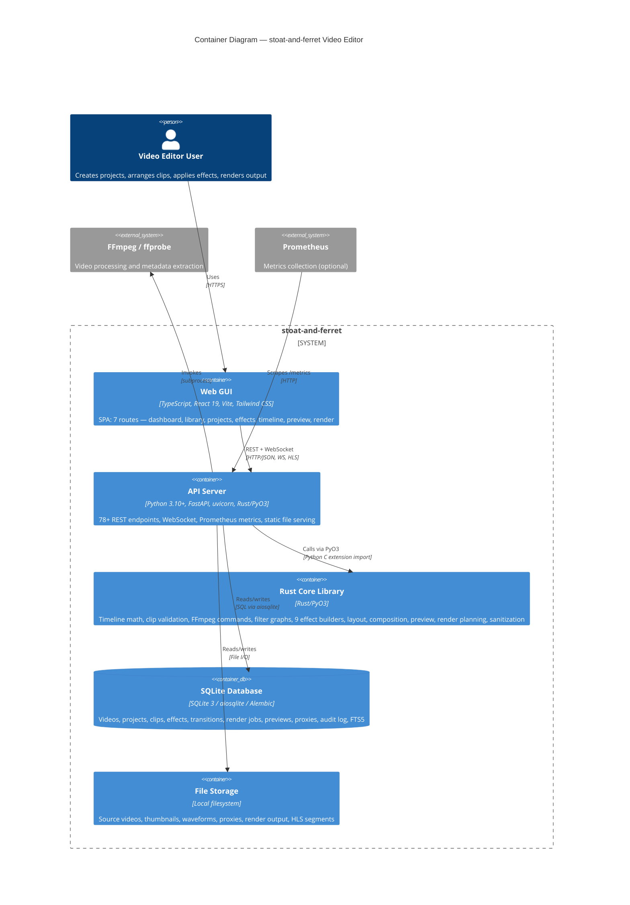

# C4 Container Level: stoat-and-ferret

## Container Diagram

```mermaid
C4Container
    title Container Diagram — stoat-and-ferret Video Editor

    Person(user, "Video Editor User", "Creates projects, arranges clips, applies effects, renders output")

    System_Boundary(system, "stoat-and-ferret") {
        Container(gui, "Web GUI", "TypeScript, React 19, Vite, Tailwind CSS", "SPA: 7 routes — dashboard, library, projects, effects, timeline, preview, render")
        Container(api, "API Server", "Python 3.10+, FastAPI, uvicorn, Rust/PyO3", "78+ REST endpoints, WebSocket, Prometheus metrics, static file serving")
        Container(rust, "Rust Core Library", "Rust/PyO3", "Timeline math, clip validation, FFmpeg commands, filter graphs, 9 effect builders, layout, composition, preview, render planning, sanitization")
        ContainerDb(db, "SQLite Database", "SQLite 3 / aiosqlite / Alembic", "Videos, projects, clips, effects, transitions, render jobs, previews, proxies, audit log, FTS5")
        Container(fs, "File Storage", "Local filesystem", "Source videos, thumbnails, waveforms, proxies, render output, HLS segments")
    }

    System_Ext(ffmpeg, "FFmpeg / ffprobe", "Video processing and metadata extraction")
    System_Ext(prometheus, "Prometheus", "Metrics collection (optional)")

    Rel(user, gui, "Uses", "HTTPS")
    Rel(gui, api, "REST + WebSocket", "HTTP/JSON, WS, HLS")
    Rel(api, rust, "Calls via PyO3", "Python C extension import")
    Rel(api, db, "Reads/writes", "SQL via aiosqlite")
    Rel(api, fs, "Reads/writes", "File I/O")
    Rel(api, ffmpeg, "Invokes", "subprocess")
    Rel(prometheus, api, "Scrapes /metrics", "HTTP")
```

## Containers

### API Server

- **Name**: API Server
- **Description**: FastAPI backend hosting the REST API, WebSocket, background job worker, effects registry (9 effects), render pipeline, HLS preview system, proxy/thumbnail/waveform generation, and serves the built GUI as static files. Single-process application with structured logging wired into lifespan startup.
- **Type**: API / Web Application
- **Technology**: Python 3.10+, FastAPI, uvicorn, Starlette, Pydantic, asyncio, structlog, prometheus-client, jsonschema
- **Deployment**: `python -m stoat_ferret.api` (uvicorn on port 8765). Dockerfile available for containerized testing.

#### Components Deployed

- [API Gateway](./c4-component-api-gateway.md) -- REST/WebSocket endpoints, middleware, schemas, settings
- [Effects Engine](./c4-component-effects-engine.md) -- EffectRegistry with 9 built-in effects, JSON Schema validation, AI hints
- [Application Services](./c4-component-application-services.md) -- Scan, media gen, FFmpeg executor, job queue, render pipeline, HLS preview
- [Data Access Layer](./c4-component-data-access.md) -- Repository pattern, domain models, schema, audit logging, Alembic migrations, logging config
- [Python Bindings Layer](./c4-component-python-bindings.md) -- Re-exports from Rust core, type stubs

#### Interfaces

- **REST API**: HTTP/JSON -- [OpenAPI spec](./apis/api-server-api.yaml)

| Group | Prefix | Count | Key Operations |
|-------|--------|-------|----------------|
| Health | `/health` | 2 | Liveness, readiness (database, Rust core, filesystem, startup gate) |
| Videos | `/api/v1/videos` | 6 | CRUD, FTS5 search, scan, thumbnail |
| Projects | `/api/v1/projects` | 4 | CRUD |
| Clips | `/api/v1/projects/{id}/clips` | 4 | CRUD with Rust validation |
| Timeline | `/api/v1/projects/{id}/timeline` | 7 | Timeline/track/clip/transition management |
| Effects | `/api/v1/effects` | 8 | Catalog, preview, thumbnail, apply/update/remove, transitions |
| Render | `/api/v1/render` | 12 | Jobs, cancel, retry, encoders, formats, preview, queue, `GET /render/{job_id}/frame_preview.jpg` |
| Preview | `/api/v1/preview` | 8 | HLS sessions, seek, manifest, segments, cache |
| Proxy | `/api/v1/videos/{id}/proxy` | 4 | Generate, status, delete, batch |
| Thumbnails | `/api/v1/videos/{id}/thumbnails` | 3 | Strip generation and serving |
| Waveform | `/api/v1/videos/{id}/waveform` | 4 | Generation, metadata, PNG, JSON samples |
| Compose | `/api/v1/compose` | 2 | Layout presets and application |
| Audio | `/api/v1/projects/{id}/audio` | 2 | Mix config and preview |
| Versions | `/api/v1/projects/{id}/versions` | 3 | Snapshot, list, restore |
| Jobs | `/api/v1/jobs` | 2 | Status and cancel |
| Filesystem | `/api/v1/filesystem` | 1 | Directory browsing |
| Version | `/api/v1/version` | 1 | App version, Rust core version, schema revision, Python version |
| Flags | `/api/v1/flags` | 1 | Feature flag state (STOAT_* boolean flags: testing_mode, seed_endpoint, synthetic_monitoring, batch_rendering) |
| Metrics | `/metrics` | 1 | Prometheus endpoint |

- **WebSocket**: `/ws` -- Real-time events (HEALTH_STATUS, SCAN_STARTED, SCAN_COMPLETED, PROJECT_CREATED, HEARTBEAT, RENDER_PROGRESS, RENDER_FRAME_AVAILABLE, and more) with configurable `ws_heartbeat_interval` (default 30s)

  | Event | Payload Fields | Description |
  |-------|---------------|-------------|
  | `render_progress` | `job_id: string`, `progress: number (0–1)`, `eta_seconds: number \| null`, `speed_ratio: number`, `frame_count: number`, `fps: number`, `encoder_name: string`, `encoder_type: string` | Incremental render completion with ETA, encoding speed, and frame statistics; throttled to prevent flooding |
  | `render_frame_available` | `job_id: string`, `frame_url: string`, `resolution: string`, `progress: number` | Notifies clients that a mid-render 540p JPEG preview frame is available at `frame_url` (e.g., `/api/v1/render/{job_id}/frame_preview.jpg`) |

- **Static GUI**: `/gui` -- Serves built React SPA assets
- **Configuration**: Environment variables with `STOAT_` prefix

  | Variable (STOAT_*) | Type | Description |
  |--------------------|------|-------------|
  | api_host | str | API server host (default: 127.0.0.1) |
  | api_port | int | API server port (default: 8765) |
  | database_path | str | SQLite database file path (default: data/stoat.db) |
  | allowed_scan_roots | list[str] | Allowed directory prefixes for scan path validation |
  | gui_static_path | str | Path to built GUI static files |
  | ws_heartbeat_interval | float | WebSocket heartbeat interval in seconds (default: 30) |
  | debug | bool | FastAPI debug mode (default: false) |
  | render_mode | Literal["real", "noop"] | Render execution mode: 'real' for FFmpeg-based rendering, 'noop' for synthetic load testing without rendering (default: real) |

- **Prometheus Metrics**: Phase 6 application-level metrics registered in `src/stoat_ferret/api/middleware/metrics.py`

  | Metric | Type | Labels | Description |
  |--------|------|--------|-------------|
  | stoat_seed_duration_seconds | Histogram | — | POST /api/v1/testing/seed duration |
  | stoat_system_state_duration_seconds | Histogram | — | GET /api/v1/system/state duration |
  | stoat_ws_buffer_size | Gauge | — | WebSocket replay deque current size |
  | stoat_ws_connected_clients | Gauge | — | Currently connected WebSocket clients |
  | stoat_active_jobs_count | Gauge | job_type | Non-terminal async job queue entries |
  | stoat_feature_flag_state | Gauge | flag | STOAT_* feature flag values as 0/1 |
  | stoat_migration_duration_seconds | Histogram | result | Alembic upgrade duration |
  | stoat_synthetic_check_total | Counter | check_name, status | Total synthetic monitoring probe executions (check_name: health_ready \| version \| system_state; status: success \| degraded \| failure \| error \| timeout) |
  | stoat_synthetic_check_duration_seconds | Histogram | check_name | Duration of each synthetic monitoring probe in seconds |

#### Dependencies

- **SQLite Database**: SQL via aiosqlite (in-process connection)
- **File Storage**: Reads source videos, writes thumbnails/waveforms/proxies/render output/HLS segments
- **Rust Core Library**: PyO3 import for clip validation, FFmpeg command building, effect/transition builders, layout, composition, preview optimization, render planning, sanitization
- **FFmpeg / ffprobe**: Subprocess invocation for all video processing
- **Prometheus** (optional): Scrapes `/metrics` endpoint

#### Build Output

- **Docker image**: Multi-stage Dockerfile -- Stage 1 compiles Rust with maturin, Stage 2 creates slim Python runtime with uv
- **Entry point**: `python -m stoat_ferret.api`
- **Scaling**: Single-process; no horizontal scaling (SQLite, in-process job queue)

---

### Web GUI

- **Name**: Web GUI
- **Description**: React SPA with 7 routes: dashboard (health/metrics), video library (search/scan), project management (clips/timeline), effect workshop (apply/edit/remove), timeline editor (tracks/clips/transitions), HLS preview with theater mode, and render management (jobs/progress/ETA). WCAG AA accessible.
- **Type**: Web Application (SPA)
- **Technology**: TypeScript, React 19, Vite 7, Tailwind CSS 4, Zustand 5, React Router 7, HLS.js, Vitest, Playwright
- **Deployment**: Built to `gui/dist/` and served by API Server at `/gui`. Dev: `npm run dev` (Vite on port 5173, proxies to API on port 8765).

#### Components Deployed

- [Web GUI](./c4-component-web-gui.md) -- 7 pages, 13 Zustand stores, 12 hooks, generated OpenAPI types, 500+ unit tests, 15 E2E tests

#### Interfaces

- **User Interface**: 7-route SPA (`/`, `/library`, `/projects`, `/effects`, `/timeline`, `/preview`, `/render`)
- **Consumed APIs**: REST `/api/v1/*`, WebSocket `/ws`, health `/health/*`, metrics `/metrics`

#### Build Output

- **Production**: `npm run build` → `gui/dist/` (HTML, JS, CSS bundles)
- **Dev proxy**: Vite proxies `/api`, `/health`, `/metrics`, `/ws` to `http://localhost:8765`

---

### Rust Core Library

- **Name**: Rust Core Library
- **Description**: Compiled native extension loaded by the API Server at import time. In-process shared library (.so/.dll/.dylib), not a separate running process.
- **Type**: Library (in-process)
- **Technology**: Rust, PyO3, pyo3-stub-gen, maturin
- **Deployment**: `maturin develop` (dev) or `maturin build --release` (Docker). Loaded as `stoat_ferret_core._core`.

#### Components Deployed

- [Rust Core Engine](./c4-component-rust-core-engine.md) -- Timeline math, clip validation, FFmpeg commands, filter graphs, expressions, drawtext, speed, audio/transition builders, layout, composition, preview optimization, render planning, sanitization
- [Python Bindings Layer](./c4-component-python-bindings.md) -- Re-export package, type stubs

#### Interfaces

- **PyO3 Module API**: `from stoat_ferret_core import ...` -- Timeline types, clip validation, FFmpeg builders, 9 effect builders, 59 transition types, layout presets, composition graphs, preview quality selection, render commands, sanitization functions

#### Build Output

- **Dev**: `maturin develop` installs into local venv
- **Release**: `maturin build --release` produces abi3 wheel (CPython >=3.10)

---

### SQLite Database

- **Name**: SQLite Database
- **Description**: Embedded file-based database. Not a separate process -- accessed in-process via aiosqlite.
- **Type**: Database (embedded)
- **Technology**: SQLite 3, aiosqlite, Alembic
- **Deployment**: File at `data/stoat.db`. Schema managed by 9 Alembic migrations.

#### Components Deployed

- Part of [Data Access Layer](./c4-component-data-access.md) -- Schema, tables, indexes, FTS5 triggers

#### Interfaces

- **SQL**: aiosqlite (async) from API Server process
  - Tables: `videos`, `projects`, `clips`, `render_jobs`, `preview_sessions`, `proxy_files`, `audit_log`, `migration_history`, `feature_flag_log`
  - Indexes: FTS5 on `videos(filename, path)`
  - Migrations: 9 versions (initial_schema → audit_log → projects → clips → transitions_effects → preview_sessions → thumbnail_strips → migration_history → feature_flag_log)

---

### File Storage

- **Name**: File Storage
- **Description**: Local filesystem directories for source videos, generated media, and the database file.
- **Type**: Storage (local filesystem)
- **Technology**: Local filesystem
- **Deployment**: `data/` directory (database, thumbnails, waveforms, proxies, render output, HLS segments) and user-configured scan roots.

#### Interfaces

- **File I/O**: Read source videos; write thumbnails, waveforms, proxies, render output, HLS segments, thumbnail strips
- **Security**: Scan path validation against `STOAT_ALLOWED_SCAN_ROOTS`

## External Systems

| System | Role | Protocol | Used By |
|--------|------|----------|---------|
| FFmpeg | Video transcoding, thumbnail/waveform/proxy gen, HLS preview, render | subprocess (CLI) | API Server |
| ffprobe | Video metadata extraction (duration, resolution, codec, fps) | subprocess (CLI) | API Server |
| Prometheus | Metrics collection (request counts, durations, effect counters) | HTTP scrape `/metrics` | Optional |

## Container-Component Mapping

| Container | Components |
|-----------|-----------|
| API Server | API Gateway, Effects Engine, Application Services, Data Access Layer, Python Bindings Layer |
| Web GUI | Web GUI (7 pages, 13 stores, 12 hooks) |
| Rust Core Library | Rust Core Engine + Python Bindings Layer (wrapping) |
| SQLite Database | Data Access Layer (schema portion) |
| File Storage | (infrastructure -- no application components) |

## Infrastructure Files

| File | Purpose |
|------|---------|
| `Dockerfile` | Production multi-stage image: Stage 1 compiles Rust with maturin; Stage 2 creates slim Python runtime with uv and a non-root user for production deployment |
| `Dockerfile.ci` | CI-specific build configuration — optimised for test matrix speed, distinct from the production Dockerfile |
| `docker-compose.yml` | Local development deployment: starts API server, frontend dev proxy, and supporting services with source directory mounts for live-reload development |
| `.github/workflows/ci.yml` | CI: test matrix (3 OS x 3 Python), Rust coverage, frontend, E2E, smoke, UAT, OpenAPI freshness |
| `pyproject.toml` | Python/Rust build config, dependencies, tool settings |
| `gui/package.json` | Frontend dependencies, build scripts, type generation |
| `alembic.ini` + `alembic/` | Database migration configuration |
