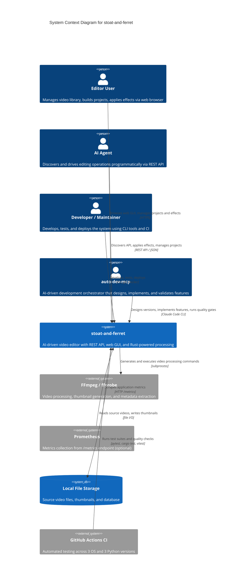

# C4 Context Level: System Context

## System Overview

### Short Description

stoat-and-ferret is an AI-driven video editor that provides a REST API and web GUI for managing video libraries, assembling editing projects, applying 9 built-in effects and transitions, and previewing FFmpeg filter strings before rendering.

### Long Description

stoat-and-ferret is a self-hosted video editing system designed for programmatic control. It provides a REST API and a React web GUI through which human users and AI agents can scan local video directories into a searchable library, assemble editing projects from clips on a timeline, apply visual and audio effects, configure transitions between clips, and preview the FFmpeg filter strings that will produce the final output.

The system is designed so that an AI agent can discover what operations are available -- the effects endpoint returns machine-readable parameter schemas and plain-language AI hints -- and then issue the same API calls a human would make through the GUI. This makes the system usable by natural-language-driven automation without custom integrations.

The editing model is non-destructive: source video files are never modified. Instead, the system builds a description of the desired output (clips, effects, transitions) and translates it into FFmpeg filter chains. All safety-critical operations -- path validation, filter text sanitization, and timeline arithmetic -- are performed by a compiled Rust library loaded into the server process.

Nine built-in effects are available: text overlay, speed control, volume, audio fade, audio mix, audio ducking, video fade, video crossfade (59 transition types), and audio crossfade. Each effect is backed by a Rust builder that generates validated FFmpeg filter strings.

The system is in alpha (v011) and targets single-user, single-machine deployment. It is not published to any package registry and has no cloud or multi-user features. Video rendering to output files is not yet implemented; the current workflow ends at project assembly with effect/transition configuration and filter string preview.

## System Context Diagram

## Personas

### Editor User (Human)

A person who uses the web GUI to manage a personal video library and create editing projects. They browse videos, organize clips into projects, apply effects like text overlays and transitions, and preview FFmpeg filter strings. They interact through the web browser at `http://localhost:8000/gui`.

- **Goals:** Build video projects from existing footage, apply creative effects, preview filter output.
- **Key features used:** Video Library, Project Management, Effect Workshop, Dashboard.
- **Constraints:** Single-user, local deployment only. No rendering to output file yet. No multi-user or cloud features.

### AI Agent (Programmatic)

An automated system (such as an LLM-based agent) that discovers the API via OpenAPI schema and drives editing operations programmatically. The API is designed with AI-first principles: self-documenting endpoints, discoverable effect catalogs with parameter schemas and AI hints, and transparent filter strings showing exactly what FFmpeg commands will be generated.

- **Goals:** Translate natural language editing instructions into API calls, apply effects and transitions, orchestrate editing workflows.
- **Key features used:** Effect Discovery, Project and Clip APIs, Effect Application, Transition Application, Job Polling.
- **Constraints:** No authentication. Batch operations require sequential API calls.

### Developer / Maintainer (Human)

A software developer who builds, tests, and deploys the system. They work across three technology stacks (Python, Rust, TypeScript), use the CLI for development workflows, and rely on CI for quality verification. They maintain PyO3 bindings between Rust and Python, manage database migrations, and ensure test coverage meets thresholds (Python 80%, Rust 75%).

- **Goals:** Extend functionality, maintain code quality, ensure cross-platform compatibility (Windows, macOS, Linux).
- **Key features used:** Health Checks, Metrics, Structured Logging, Quality Gates, CI Pipeline.
- **Constraints:** Hybrid build system requires Python, Rust, and Node.js toolchains.

### auto-dev-mcp (Programmatic)

An AI-driven development orchestrator that designs version plans, generates implementation prompts, spawns Claude Code CLI sessions to implement features, runs quality gates, and tracks progress through a structured inbox/outbox workflow. It manages the full development lifecycle from backlog items to merged pull requests.

- **Goals:** Autonomously implement features from backlog, maintain quality standards, generate documentation.
- **Key features used:** Quality Gates (ruff, mypy, pytest, cargo test), Git/GitHub integration, PR lifecycle.
- **Constraints:** Operates on the codebase (not the running application). Limited to 3 CI fix attempts per feature.

## System Features

| Feature | Description | Personas | Containers |
|---------|-------------|----------|------------|
| Video Library Management | Scan directories for video files, extract metadata via ffprobe, generate thumbnails, full-text search by filename and path | Editor, AI Agent | API Server, SQLite DB, File Storage |
| Project Management | Create editing projects, add clips with in/out points, update/delete clips, manage clip ordering on a timeline | Editor, AI Agent | API Server, Rust Core, SQLite DB |
| Effect Application | Apply 9 built-in effects to clips with full CRUD lifecycle (apply, update, remove) and JSON Schema validation | Editor, AI Agent | API Server, Rust Core, SQLite DB |
| Transition Application | Apply transitions between adjacent clips with clip adjacency validation and 59 transition types | Editor, AI Agent | API Server, Rust Core, SQLite DB |
| Effect Discovery | Browse all effects with JSON Schema parameter definitions, AI hints per parameter, and live filter string previews | Editor, AI Agent | API Server, Rust Core |
| Effect Workshop (GUI) | Interactive effect builder with catalog, parameter forms, filter preview, and effect stack with apply/edit/remove | Editor | Web GUI, API Server |
| Filesystem Browser | Browse local directories for scan path selection with security validation against allowed roots | Editor | Web GUI, API Server |
| Web Dashboard | Live health cards, metrics overview, and WebSocket activity log with configurable heartbeat | Editor, Developer | Web GUI, API Server |
| Async Job Processing | Background job queue for directory scanning with progress reporting, status polling, and cooperative cancellation | Editor, AI Agent | API Server |
| Health Monitoring | Liveness and readiness probes checking database, FFmpeg, and Rust core availability | Developer | API Server, Rust Core |
| Observability | Prometheus metrics, structured JSON logs with rotation, correlation IDs, and audit trail | Developer | API Server |
| Automated Development | Version design, feature implementation, quality gates, and PR lifecycle managed by auto-dev-mcp | auto-dev-mcp | Codebase, CI |

## User Journeys

### Editor: Import Videos and Build a Project with Effects

1. Open the web GUI at `http://localhost:8000/gui`; confirm the Dashboard shows green health status
2. Navigate to the **Library** tab; click "Scan Directory" and browse to a local folder (`GET /api/v1/filesystem/directories`)
3. Submit the scan; monitor progress via the activity feed (`POST /api/v1/videos/scan`, then `GET /api/v1/jobs/{id}`)
4. Browse imported videos in the library grid; use search to find footage (`GET /api/v1/videos/search`)
5. Navigate to **Projects**; create a new project (`POST /api/v1/projects`)
6. Add clips with in/out points (`POST /api/v1/projects/{id}/clips`); update or reorder as needed (`PATCH ...`)
7. Open the **Effects** tab; select a clip, browse the catalog, choose "Text Overlay"
8. Fill in parameters; observe the live filter preview; click "Apply" (`POST .../clips/{id}/effects`)
9. Add more effects or apply a crossfade transition between adjacent clips (`POST .../effects/transition`)
10. Edit or remove effects from the stack using inline controls (`PATCH/DELETE .../effects/{index}`)

*Note: Rendering to an output video file is not yet implemented. The workflow currently ends at project assembly with filter preview.*

### AI Agent: Discover Effects and Drive an Editing Workflow

1. Fetch the OpenAPI schema at `GET /openapi.json` to discover available endpoints
2. Query `GET /api/v1/effects` to receive all 9 effects with parameter schemas and AI hints
3. Create a project via `POST /api/v1/projects`
4. Add clips via `POST /api/v1/projects/{id}/clips` with source video path and time range
5. Preview a text overlay via `POST /api/v1/effects/preview` to verify the filter string
6. Apply the effect via `POST .../clips/{id}/effects`; response includes the generated FFmpeg filter string
7. Apply a transition between adjacent clips via `POST .../effects/transition`
8. Update an effect via `PATCH .../effects/{index}`; remove via `DELETE .../effects/{index}`

### Developer: Quality Verification and Deployment

1. Clone the repository; install toolchains (`uv sync`, `cd gui && npm install`, `maturin develop`)
2. Run Python checks: `uv run ruff check .`, `uv run mypy src/`, `uv run pytest` (80% coverage)
3. Run Rust checks: `cargo clippy -- -D warnings`, `cargo test`
4. Run frontend checks: `npx tsc -b`, `npx vitest run`
5. Push to GitHub; CI runs 9-matrix tests (3 OS x 3 Python), Rust coverage, Playwright E2E
6. Fix CI failures (up to 3 attempts); merge via `gh pr merge --squash --delete-branch`

### Automated Development: auto-dev-mcp Feature Delivery

1. auto-dev-mcp reads backlog items and designs a version with themes and features
2. For each feature, it generates an implementation prompt with requirements and plan
3. A Claude Code CLI session implements the feature, creates tests, and opens a PR
4. Quality gates run (ruff, mypy, pytest, cargo test, vitest); failures are fixed (up to 3 attempts)
5. PR is merged on CI success; completion report and learnings are recorded
6. Theme and version retrospectives are generated after all features complete

## External Systems and Dependencies

| System | Required | Integration | Purpose |
|--------|----------|-------------|---------|
| FFmpeg / ffprobe | Yes | Subprocess | Video metadata extraction, thumbnail generation. Must be installed on host. Verified by readiness probe. |
| Local Filesystem | Yes | File I/O | Source videos (user-configured scan roots), SQLite database (`data/stoat.db`), thumbnails (`data/thumbnails/`). Paths validated by Rust. |
| SQLite | Yes | Embedded (aiosqlite) | In-process database for videos, projects, clips (with effects/transitions JSON), audit log, FTS5 search index. Schema managed by Alembic. |
| Prometheus | No | HTTP pull (`/metrics`) | Optional metrics for HTTP requests, FFmpeg execution, effect/transition counters. |
| GitHub Actions CI | No | Git push trigger | 9-matrix test (3 OS x 3 Python), Rust coverage (75% min), frontend tests, Playwright E2E with WCAG AA audits. |
| Docker | No | Multi-stage build | Optional containerized deployment. Builder compiles Rust with maturin; runtime uses uv. |

## Related Documentation

- [C4 Container Diagram](./c4-container.md) -- Deployment view of all containers and their interfaces
- [C4 Component Overview](./c4-component.md) -- Internal component architecture and relationships
- [System Architecture](../design/02-architecture.md) -- Detailed technical architecture
- [API Specification](../design/05-api-specification.md) -- REST API endpoint reference
- [GUI Architecture](../design/08-gui-architecture.md) -- Web frontend design
- [Implementation Roadmap](../design/01-roadmap.md) -- Phased development plan
