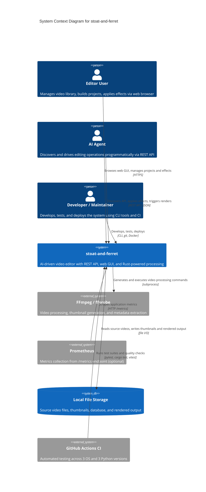

# C4 Context Level: System Overview

## System Overview

### Short Description

stoat-and-ferret is an AI-driven video editor that provides a REST API and web GUI for managing video libraries, assembling editing projects, applying 9 built-in effects and transitions, and rendering output files.

### Long Description

stoat-and-ferret is a self-hosted video editing system designed for programmatic control. It provides a REST API and a React web GUI through which human users and AI agents can scan local video directories into a searchable library, assemble editing projects from clips on a timeline, apply visual and audio effects, configure transitions between clips, and render the result to an output file.

The system is designed so that an AI agent can discover what operations are available -- the effects endpoint returns machine-readable parameter schemas and plain-language AI hints -- and then issue the same API calls a human would make through the GUI. This makes the system usable by natural-language-driven automation without custom integrations.

The editing model is non-destructive: source video files are never modified. Instead, the system builds a description of the desired output (clips, effects, transitions) and translates it into FFmpeg filter chains for rendering. All safety-critical operations -- path validation, filter text sanitization, and timeline arithmetic -- are performed by a compiled Rust library loaded into the server process, providing compile-time correctness guarantees.

Nine built-in effects are available: text overlay, speed control, volume, audio fade, audio mix, audio ducking, video fade, video crossfade (59 transition types), and audio crossfade. Each effect is backed by a Rust builder that generates validated FFmpeg filter strings.

The system is currently in alpha and targets single-user, single-machine deployment. As of v008, startup is fully wired: the database schema is created on first run, structured logging is configured at startup using the `log_level` setting, and all application settings (`debug`, `ws_heartbeat_interval`) are wired to their consumers.

## System Context Diagram

## Personas

### Editor User (Human)

A person who uses the web GUI to manage a personal video library and create editing projects. They browse videos, organize clips into projects, apply effects like text overlays and transitions, and export finished videos. They interact through the web browser at `http://localhost:8000/gui`.

- **Goals:** Build video projects from existing footage, apply creative effects, produce finished video files.
- **Key features used:** Video Library, Project Management, Effect Workshop, Dashboard.
- **Constraints:** Single-user, local deployment only. No multi-user or cloud features.

### AI Agent (Programmatic)

An automated system (such as Claude or another LLM-based agent) that discovers the API via OpenAPI schema and drives editing operations programmatically. The API is designed with AI-first principles: self-documenting endpoints, discoverable effect catalogs with parameter schemas and AI hints, and transparent filter strings showing exactly what FFmpeg commands will be generated.

- **Goals:** Translate natural language editing instructions into API calls, apply effects and transitions, orchestrate complete editing workflows.
- **Key features used:** Effect Discovery, Project and Clip APIs, Effect Application, Transition Application, Job Polling.
- **Constraints:** No authentication required for single-user deployment. Batch operations require sequential API calls.

### Developer / Maintainer (Human)

A software developer who builds, tests, and deploys the system. They work across three technology stacks (Python, Rust, TypeScript), use the CLI for development workflows, and rely on CI for quality verification. They maintain PyO3 bindings between Rust and Python, manage database migrations, and ensure test coverage meets thresholds (Python 80%, Rust 75%). In v008, startup wiring was completed: database creation, structured logging, and all application settings are now verified by dedicated test suites.

- **Goals:** Extend functionality, maintain code quality, ensure cross-platform compatibility (Windows, macOS, Linux).
- **Key features used:** Health Checks, Metrics, Structured Logging, Quality Gates, CI Pipeline.
- **Constraints:** Hybrid build system requires Python, Rust, and Node.js toolchains.

## System Features

| Feature | Description | Personas | Containers |
|---------|-------------|----------|------------|
| Video Library Management | Scan local directories for video files, extract metadata via ffprobe, generate thumbnails, full-text search by filename and path | Editor, AI Agent | API Server, SQLite DB, File Storage |
| Project Management | Create editing projects, add clips with in/out points, manage clip ordering on a timeline with Rust-calculated positions | Editor, AI Agent | API Server, Rust Core, SQLite DB |
| Effect Application | Apply 9 built-in effects to clips: text overlay, speed control, volume, audio fade, audio mix, audio ducking, video fade, crossfade (59 types), audio crossfade | Editor, AI Agent | API Server, Rust Core, SQLite DB |
| Transition Application | Apply transitions between adjacent clips in a project timeline with validation of clip adjacency | Editor, AI Agent | API Server, Rust Core, SQLite DB |
| Effect Discovery | Browse all effects with JSON Schema parameter definitions, AI hints per parameter, and live filter string previews generated by Rust builders | Editor, AI Agent | API Server, Rust Core |
| Effect Workshop (GUI) | Interactive effect builder with catalog browsing, schema-driven parameter forms, filter string preview, clip selector, and effect stack management with apply/edit/remove lifecycle | Editor | Web GUI, API Server |
| Web Dashboard | Live system health cards, Prometheus metrics overview, and WebSocket activity log showing real-time events with configurable heartbeat interval | Editor, Developer | Web GUI, API Server |
| Video Library Browser (GUI) | Grid view of imported videos with search, sort, pagination, and scan directory modal | Editor | Web GUI, API Server |
| API Discovery | Auto-generated OpenAPI schema, Swagger UI at /docs, and ReDoc at /redoc | AI Agent | API Server |
| Health Monitoring | Liveness and readiness probes checking database, FFmpeg availability, and Rust core status | Developer | API Server, Rust Core |
| Observability | Prometheus metrics (HTTP requests, FFmpeg execution, effect/transition counters), structured JSON logs wired at startup with configurable log level, correlation IDs, audit trail | Developer | API Server |
| Async Job Processing | Background job queue for directory scanning with status polling (pending, running, complete, failed, timeout) | Editor, AI Agent | API Server |

## User Journeys

### Editor: Import Videos and Build a Project with Effects

1. Open the web GUI at `http://localhost:8000/gui` and confirm the Dashboard shows green health status
2. Navigate to the **Library** tab and click "Scan Directory" to import videos from a local folder
3. Monitor the scan via the activity feed; the scan runs as a background job (`POST /api/v1/videos/scan`)
4. Browse imported videos in the library grid; use the search bar to find specific footage (`GET /api/v1/videos/search`)
5. Navigate to the **Projects** tab and create a new project (`POST /api/v1/projects`)
6. Add clips to the project by selecting videos and specifying in/out points (`POST /api/v1/projects/{id}/clips`)
7. Navigate to the **Effects** tab (Effect Workshop)
8. Select a clip from the clip selector, browse the effect catalog, and choose "Text Overlay"
9. Fill in the parameter form (text, position, font size); observe the live filter preview
10. Click "Apply Effect" to attach the effect to the clip (`POST /api/v1/projects/{id}/clips/{id}/effects`)
11. Select another effect type (e.g., "Video Fade") and apply it; the effect stack shows both effects
12. Apply a crossfade transition between two adjacent clips (`POST /api/v1/projects/{id}/effects/transition`)
13. Edit or remove effects from the effect stack using the inline controls

### AI Agent: Discover Effects and Drive an Editing Workflow

1. Fetch the OpenAPI schema at `GET /openapi.json` to discover available endpoints
2. Query `GET /api/v1/effects` to receive all 9 effects with parameter schemas and AI hints
3. Create a project via `POST /api/v1/projects` with a name
4. Add clips via `POST /api/v1/projects/{id}/clips` with source video path and time range
5. Preview a text overlay via `POST /api/v1/effects/preview` to verify the filter string
6. Apply the effect via `POST /api/v1/projects/{id}/clips/{id}/effects`; the response includes the generated FFmpeg filter string for transparency
7. Apply a dissolve transition between adjacent clips via `POST /api/v1/projects/{id}/effects/transition` with `transition_type: "xfade"` and `parameters: {transition: "dissolve", duration: 1.0, offset: 5.0}`
8. Update an effect via `PATCH /api/v1/projects/{id}/clips/{id}/effects/{index}` with new parameters
9. Remove an effect via `DELETE /api/v1/projects/{id}/clips/{id}/effects/{index}`

### Developer: Quality Verification and Deployment

1. Clone the repository and install all toolchains (`uv sync`, `cd gui && npm install`, `maturin develop`)
2. Run Python quality checks: `uv run ruff check .` (lint), `uv run mypy src/` (type check), `uv run pytest` (tests with 80% coverage threshold)
3. Run Rust quality checks: `cargo clippy -- -D warnings`, `cargo test`
4. Run frontend checks: `npx tsc -b`, `npx vitest run`
5. Implement changes; include PyO3 bindings in the same feature (not deferred)
6. Regenerate type stubs via `cargo run --bin stub_gen` and verify with `python scripts/verify_stubs.py`
7. Push to GitHub; CI runs 9-matrix tests (3 OS x 3 Python), Rust coverage, E2E Playwright tests (15 tests including WCAG AA accessibility audits and effect workshop lifecycle)
8. Fix any CI failures (up to 3 attempts), then merge via `gh pr merge --squash --delete-branch`

## External Systems and Dependencies

| System | Required | Integration | Purpose |
|--------|----------|-------------|---------|
| FFmpeg / ffprobe | Yes | Subprocess invocation | All video processing: metadata extraction, thumbnail generation, filter application, rendering. Must be installed on the host. Readiness probe verifies availability. |
| Local Filesystem | Yes | File I/O | Source video files (user-configured scan roots), SQLite database file (`data/stoat.db`), generated thumbnails (`data/thumbnails/`). Scan paths validated by Rust to prevent directory traversal. |
| SQLite | Yes | Embedded (aiosqlite) | In-process database for video metadata, projects, clips (with effects JSON), audit log, and FTS5 search index. Schema created automatically on startup via `create_tables()`. Schema managed by Alembic migrations. |
| Prometheus | No | HTTP pull (`/metrics`) | Optional metrics collection for HTTP request counts/durations, FFmpeg execution metrics, and effect/transition application counters. |
| GitHub Actions CI | No | Git push trigger | Automated quality verification: 9-matrix test (3 OS x 3 Python versions), Rust coverage (75% minimum), frontend tests, E2E Playwright tests with axe-core accessibility audits. |
| Docker | No | Multi-stage build | Optional containerized deployment. Builder stage compiles Rust extension with maturin; runtime stage creates slim Python environment with uv. |

## Related Documentation

- [C4 Container Diagram](./c4-container.md) -- Deployment view of all containers and their interfaces
- [C4 Component Overview](./c4-component.md) -- Internal component architecture and relationships
- [System Architecture](../design/02-architecture.md) -- Detailed technical architecture
- [API Specification](../design/05-api-specification.md) -- REST API endpoint reference
- [GUI Architecture](../design/08-gui-architecture.md) -- Web frontend design
- [Implementation Roadmap](../design/01-roadmap.md) -- Phased development plan
