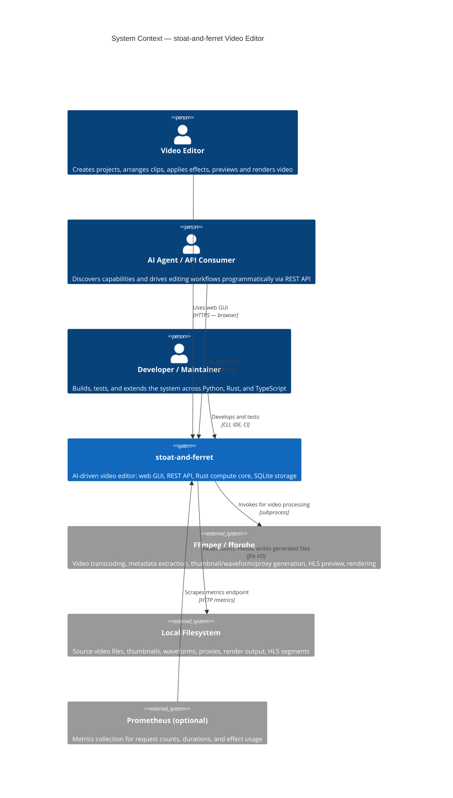

# C4 System Context: stoat-and-ferret

## System Overview

**Short:** An AI-driven video editor that lets people and programs create, edit, and render video projects through a web interface or REST API.

**Long:** stoat-and-ferret is a non-destructive video editing system with a hybrid Python/Rust architecture. Users import video files, organize them into projects, arrange clips on a multi-track timeline, apply visual effects and transitions, preview results via HLS streaming, and render final output. The system exposes 78+ REST endpoints designed for both human use (via a React web GUI) and programmatic control (via AI agents or scripts). A high-performance Rust core handles compute-intensive operations — timeline math, filter graph construction, input sanitization — while Python manages HTTP routing, database access, and process orchestration. The system is in alpha and targets single-user, local deployment.

## System Context Diagram

```mermaid
C4Context
    title System Context — stoat-and-ferret Video Editor

    Person(editor, "Video Editor", "Creates projects, arranges clips, applies effects, previews and renders video")
    Person(agent, "AI Agent / API Consumer", "Discovers capabilities and drives editing workflows programmatically via REST API")
    Person(dev, "Developer / Maintainer", "Builds, tests, and extends the system across Python, Rust, and TypeScript")

    System(sf, "stoat-and-ferret", "AI-driven video editor: web GUI, REST API, Rust compute core, SQLite storage")

    System_Ext(ffmpeg, "FFmpeg / ffprobe", "Video transcoding, metadata extraction, thumbnail/waveform/proxy generation, HLS preview, rendering")
    System_Ext(filesystem, "Local Filesystem", "Source video files, thumbnails, waveforms, proxies, render output, HLS segments")
    System_Ext(prometheus, "Prometheus (optional)", "Metrics collection for request counts, durations, and effect usage")

    Rel(editor, sf, "Uses web GUI", "HTTPS — browser")
    Rel(agent, sf, "Calls REST API", "HTTP/JSON")
    Rel(dev, sf, "Develops and tests", "CLI, IDE, CI")
    Rel(sf, ffmpeg, "Invokes for video processing", "subprocess")
    Rel(sf, filesystem, "Reads source media, writes generated files", "file I/O")
    Rel(prometheus, sf, "Scrapes metrics endpoint", "HTTP /metrics")
```

## Personas

### 1. Video Editor (Primary User)

A person who edits video through the web GUI. They import files, create projects, arrange clips on a multi-track timeline, apply effects and transitions, preview via HLS streaming, and render final output. They interact through a browser at `http://localhost:8765/gui`.

- **Goals:** Build video projects from existing footage, apply creative effects and transitions, preview results, render final video.
- **Key features:** Video Library, Timeline Editing, Effects & Transitions, HLS Preview, Render Pipeline.

### 2. AI Agent / API Consumer

A program or AI assistant (e.g., Claude) that controls the editor programmatically. It discovers available effects and capabilities via OpenAPI schemas and AI hints, creates projects, builds timelines, previews FFmpeg commands, and triggers renders — all through the REST API.

- **Goals:** Translate editing instructions into API calls, orchestrate automated editing workflows, inspect generated FFmpeg commands.
- **Key features:** Effect Discovery (AI hints), Project/Clip/Timeline APIs, Render Preview, Batch Operations.

### 3. Developer / Maintainer

A software engineer who builds, tests, and extends stoat-and-ferret across three technology stacks (Python, Rust, TypeScript). They run quality gates, manage PyO3 bindings and database migrations, and validate changes via CI across 3 OS and 3 Python versions.

- **Goals:** Extend functionality, maintain quality thresholds (Python 80%, Rust 90% coverage), ensure cross-platform compatibility.
- **Key features:** Health Checks, Metrics, Structured Logging, Quality Gates, CI Pipeline.

## System Features

| # | Feature | Description | Personas | Containers |
|---|---------|-------------|----------|------------|
| 1 | Video Library | Scan directories, extract metadata via ffprobe, generate thumbnails/waveforms, full-text search | Editor, Agent | API Server, SQLite, File Storage |
| 2 | Project Management | Create, update, delete, and version projects with snapshot/restore | Editor, Agent | API Server, SQLite |
| 3 | Timeline Editing | Multi-track timeline with clip arrangement, track management, clip ordering | Editor, Agent | API Server, Rust Core |
| 4 | Effects & Transitions | 9 built-in effects, 59 transition types, apply/update/remove with JSON Schema validation | Editor, Agent | API Server, Rust Core |
| 5 | Composition & Layout | Arrange multiple inputs using layout presets (side-by-side, picture-in-picture, grid) | Editor, Agent | API Server, Rust Core |
| 6 | Audio Mixing | Configure audio mix settings and preview audio across clips | Editor, Agent | API Server, Rust Core |
| 7 | HLS Preview | Stream timeline preview via HLS with seek, quality selection, caching, and theater mode | Editor | API Server, Web GUI, FFmpeg |
| 8 | Render Pipeline | Queue, execute, cancel, retry, and batch render jobs with progress, ETA, and speed tracking | Editor, Agent | API Server, Rust Core, FFmpeg |
| 9 | Proxy Generation | Create lower-resolution proxy files for faster editing; batch operations supported | Editor, Agent | API Server, FFmpeg, File Storage |
| 10 | Thumbnail Strips | Generate filmstrip-style thumbnail strips for timeline scrubbing | Editor | API Server, FFmpeg, File Storage |
| 11 | Health & Metrics | Liveness/readiness probes, Prometheus metrics, dashboard with system status | Editor, Dev | API Server, Web GUI |
| 12 | Real-time Updates | WebSocket events for scan progress, render status, health changes, heartbeats | Editor | API Server, Web GUI |
| 13 | AI Discoverability | OpenAPI schemas, effect AI hints, parameter definitions for programmatic discovery | Agent | API Server |

## User Journeys

### Journey 1: Video Editor — Import, Edit, and Render

1. Open the Web GUI at `http://localhost:8765/gui`; the Dashboard shows health status
2. Navigate to Library; click "Scan Directory" and browse to a local folder
3. Submit the scan; the system imports videos, extracts metadata, and generates thumbnails
4. Search and browse imported videos in the library grid
5. Create a new project from the Projects page
6. Add clips to the timeline with in/out points; arrange across tracks
7. Open the Effect Workshop; browse 9 effects, configure parameters, preview the filter string
8. Apply effects to clips; add transitions between adjacent clips
9. Preview the timeline via HLS streaming with seek and quality controls
10. Start a render job; monitor progress, ETA, and speed in real time on the Render page

> **Deployment note:** stoat-and-ferret is alpha-stage and runs locally on `localhost:8765`. It is not publicly deployed.

### Journey 2: AI Agent — Programmatic Editing Workflow

1. Fetch `GET /api/v1/effects` to discover all effects with parameter schemas and AI hints
2. Scan a directory: `POST /api/v1/videos/scan`
3. Create a project: `POST /api/v1/projects`
4. Add clips: `POST /api/v1/projects/{id}/clips` (Rust-validated timing)
5. Build timeline: create tracks and arrange clips via timeline endpoints
6. Apply effects: `POST /api/v1/effects/apply` with JSON Schema-validated parameters
7. Preview the FFmpeg command: `POST /api/v1/render/preview`
8. Start render: `POST /api/v1/render/jobs`; poll status or listen on WebSocket `/ws`

### Journey 3: Developer — Build, Test, and Contribute

1. Clone repo; set up with `uv sync`, `cd gui && npm install`, `maturin develop`
2. Make changes to Python, Rust, or TypeScript source
3. Run quality gates: `ruff check`, `mypy`, `pytest`, `cargo clippy`, `cargo test`, `tsc`, `vitest`
4. After Rust API changes, regenerate stubs with `cargo run --bin stub_gen` and verify
5. Push branch and open PR; CI runs full matrix (3 OS x 3 Python, Rust, frontend, smoke, UAT)
6. Fix CI failures (up to 3 attempts); merge via squash-merge

## External Systems and Dependencies

| System | Required | Protocol | Purpose |
|--------|----------|----------|---------|
| FFmpeg | Yes | Subprocess CLI | Video transcoding, rendering, thumbnail/waveform/proxy generation, HLS streaming |
| ffprobe | Yes | Subprocess CLI | Video metadata extraction (duration, resolution, codec, FPS) |
| SQLite 3 | Yes | In-process (aiosqlite) | Persistent storage: videos, projects, clips, render jobs, previews, proxies, audit log, FTS5 search. Schema managed by Alembic (9 migrations). |
| Local filesystem | Yes | File I/O | Source videos, thumbnails, waveforms, proxies, render output, HLS segments. Paths validated against `STOAT_ALLOWED_SCAN_ROOTS`. |
| Prometheus | No | HTTP scrape `/metrics` | Request counts, durations, effect usage counters, FFmpeg execution metrics |

## Related Documentation

- [C4 Container Diagram](./c4-container.md) — Deployment view of all containers and their interfaces
- [C4 Component Overview](./c4-component.md) — Internal component architecture and relationships
- [System Architecture](../ARCHITECTURE.md) — High-level architecture overview
- [Detailed Architecture](../design/02-architecture.md) — Technical architecture with data models and flows
- [API Specification](../design/05-api-specification.md) — REST API endpoint reference
- [Developer Guide](../../AGENTS.md) — Commands, coding standards, PR workflow
